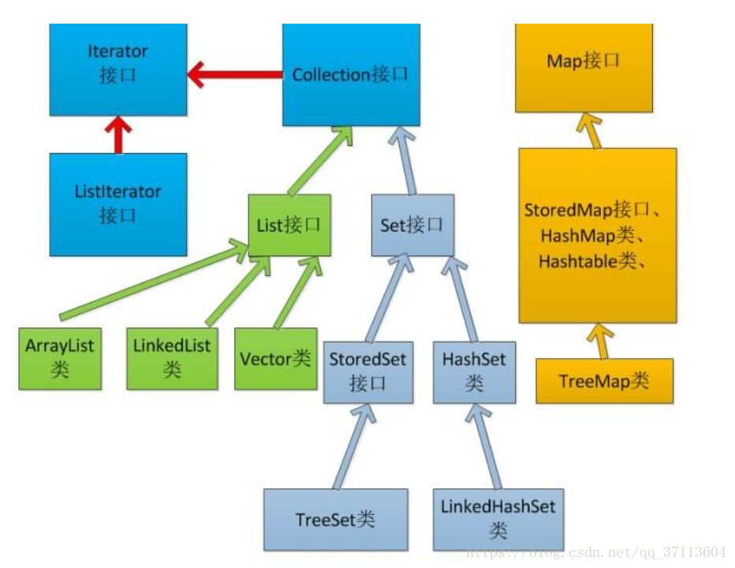

<!--
 * @Author: ZhXZhao
 * @Date: 2021-04-29 17:16:02
 * @LastEditors: ZhXZhao
 * @LastEditTime: 2021-04-29 18:27:01
 * @Description: file conten
-->

# Vector和ArrayList的异同

集合类分为两个分支，Collection和Map，其中Collection接口继承了Iterator接口，继承Iterator接口的类都可以使用迭代器来遍历元素。

## 相同点
- ArrayList与Vector底层实现都是以Object数组的形式实现的。
- ArrayList与Vector继承的类和实现的接口都是一样的，都继承了AbstractList类（继承后可以使用迭代器遍历），实现了RandomAccess接口，cloneable接口，serializable接口。
- 初始容量都默认为10，容量不够时都会自动扩容。

## 不同点
- ArrayList是在增加第一条数据的时候分配内存空间，Vector是在创建对象的时候就分配了内存空间。
- ArrayList默认扩容倍数为1.5倍，Vector默认扩容倍数为2倍，Vector可以自定义扩容，若自定义了增长因子，则Vector扩容方式变为 $ 新长度=原长度+增长因子 $。
- ArrayList可以通过传入Collection作为构造函数的参数来实例化，Vector可以传入**初始容量**和**增长因子**作为构造函数的参数来实例化。
- Vector是线程安全的，ArrayList是线程不安全的。Vector的大多数方法都用synchronized关键字修饰；ArrayList可以通过Collection.synchronizedList()来实现线程安全。
- ArrayList的性能优于Vector。因为Vector的方法都有同步锁，方法执行时需要加锁、解锁。底层的Object数组也有区别：
  + ArrayList的Object数组使用了transient关键字修饰，防止序列化，提升传输效率。例如，在将元素进行遍历传输的时候，如果容量为10000，但实际只有8000元素，ArrayList只会传输8000个实际元素，而不会将2000个空元素也传输。

## 迭代时，线程安全是如何实现的？
AbstractList类中有一个静态变量modCount，用来记录一个集合类对象被修改的次数。当ArrayList和Vector调用iterator方法时，即Iterator i1 = arrayList1.iterator(); Iterator i2 = vector2.iterator();返回的Iterator对象为类的一个私有内部类，类在调用时便初始化了expectedModCount=modCount，即在迭代前先用成员变量记录下modCount的值，在迭代时首先会调用checkForComodification方法，来比较modCount值有没有改变，如果改变则抛出异常，这样就保证了迭代时的线程安全。

