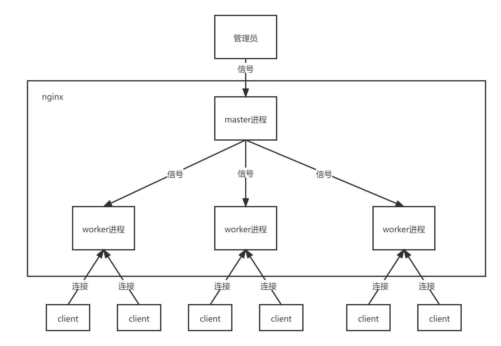
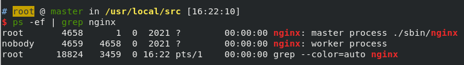

<!--
 * @Author: ZhXZhao
 * @Date: 2021-12-30 11:00:11
 * @LastEditors: ZhXZhao
 * @LastEditTime: 2022-01-02 14:34:14
 * @Description: file content
-->
# nginx简介

nginx是一个高性能http服务器和反向代理服务器。

作用：
- 反向代理
- 负载均衡
- 动静分离

## 反向代理

### 正向代理

客户端需配置代理服务器，而后局域网内的用户可以借助正向代理服务器来访问互联网上的其他资源。

### 反向代理

客户端对代理无感，且不需要任何配置就可以访问。将请求发送到反向代理服务器，由反向代理服务器去选择目标服务器获取数据后，再返回给客户端。暴露的是代理服务器的IP地址，隐藏了真实服务器（目标服务器）的IP地址。

## 负载均衡

单个服务器无法应对的场景，通过增加服务器的数量，将请求分发到各个服务器上，将原先请求集中到单个服务器上的情况改为将请求分发到多个服务器上，将负载分发到不同的服务器就是所谓的负载均衡。

### 负载均衡的策略

1. 轮询（默认）
   每个请求按照时间顺序逐一分配到不同的后端服务器，如果有后端服务器down了，会自动剔除。
2. 权重（weight）
   默认weight为1，权重越高，被分配的客户端请求越多。
3. ip_hash
   在配置文件中加入$ip_hash;$命令。每个请求按访问ip的hash结果分配，每个访客固定访问一个后端服务器，解决session问题。
4. fair（第三方）
   按照后端服务器的响应请求的时间进行分配，响应时间短的优先分配。

## 动静分离

为了加快网站的解析速度，可以把动态页面和静态页面由不同的服务器来解析，加快解析速度，降低原来单个服务器的压力。

其本质是将动态请求和静态请求分开，由专门的服务器处理静态请求，再有其他的专门服务器处理动态请求。通expires设置浏览器的缓存时间。

## 高可用

高可用即为当一台nginx服务宕机时，另一台从服务器可以立即接管流量。
需利用keepalived来实现。

## 原理

### master && worker

### worker

多个worker之间通过竞争的方式来从master处获得任务执行。

### 好处

一个master，多个worker：
- 可以实现热部署，nginx -s reload不会停机
- 提高容错，多个worker进程相互独立，无需加锁。当有一个worker进程挂了，其余worker进程还可继续工作，服务不会中断。

### worker数量设置

Nginx和redis类似，都采用了**i/o多路复用机制**，每个worker都是一个独立的进程，每个进程里只有一个主线程，通过异步非阻塞的方式来处理请求。每个worker进程中的线程都可以独占CPU，所以worker数设置为和CPU数相等最为合适。

## 连接数worker_connection

worker_connection表示每个worker进程所能建立连接的最大值。一个请求占用worker进程2个或4个连接数。
