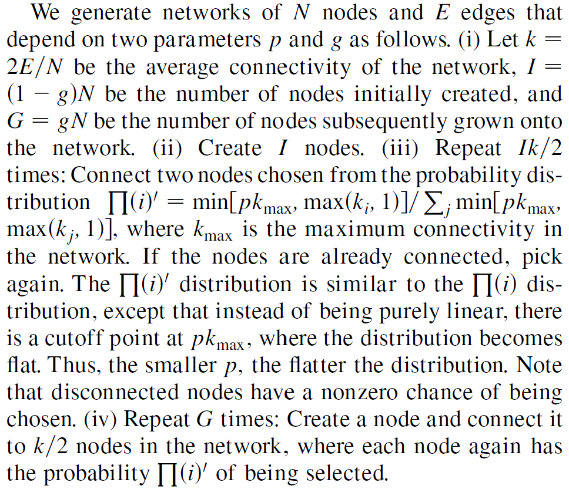

<!--
 * @Author: ZhXZhao
 * @Date: 2020-03-09 16:56:28
 * @LastEditors: ZhXZhao
 * @LastEditTime: 2020-03-10 00:36:05
 * @Description: 
 -->

# Optimization of Robustness and Connectivity in Complex Networks

---

无标度（scale-free）网络中，节点的度呈幂律分布，即有少数的节点具有很高的度，大多数节点度很低。这样的网络结构缩短了任意节点之间的路径，进而提升了网络的连接性。但过于依赖高度的节点也会使得网络易受定向攻击。

指数网络或随机网络相较于无标度网络来说，连接性和容错性略逊一筹，但是对于攻击的鲁棒性更强。

通过参数化网络的两个方面：growth和preferential attachment，本文展示了一类更一般的复杂网络。通过优化这两个参数，可以构建一个连接性接近无标度网络，对攻击的鲁棒性相似于指数网络，容错性比无标度网络和指数网络都强的网络。

记preferential attachment为p，growth为g，取值范围均为[0,1]。0表示参数没有作用于网络中，1表示参数最大程度地作用了在网络中。指数网络可以表示为p=g=0，无标度网络可以表示为p=g=1。目标是生成具有最佳鲁棒性的网络。通过实验发现(p,g)=(1,0)的网络具有最佳的鲁棒性。

g表示后加入网络中的节点比例。即共有N个节点，在网络最初创建时，创建(1-g)N个节点，随后再添加gN个节点。
p表示创建好(1-g)N个节点后，两个节点之间相连的概率分布。也表示在随后添加进网络的节点，以p的概率分布去与网络中k/2个节点相连。k表示网络的连通性。p越大，已连接的节点被选中的机会就越大。

创建网络的过程：

最后通过不断尝试参数的实验，得出结论，(p,g)=(1,0)网络具有更加的鲁棒性。

