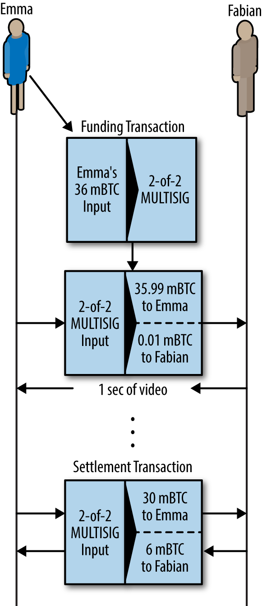
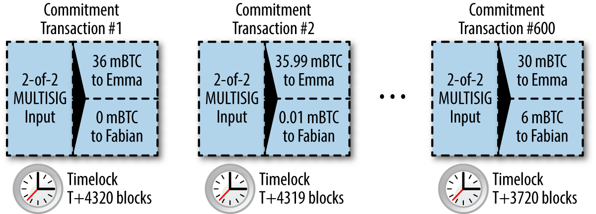
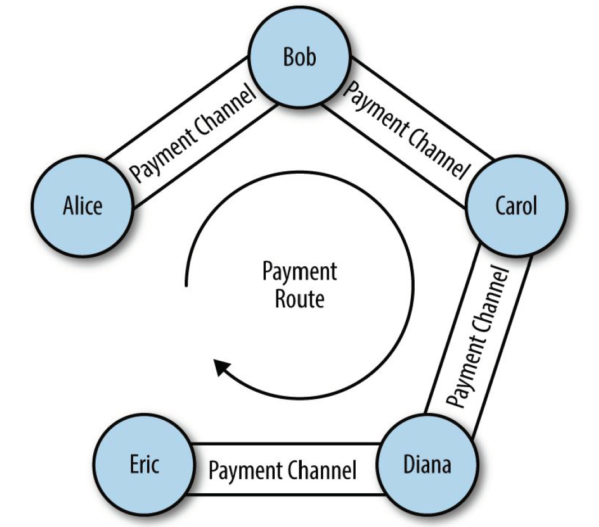
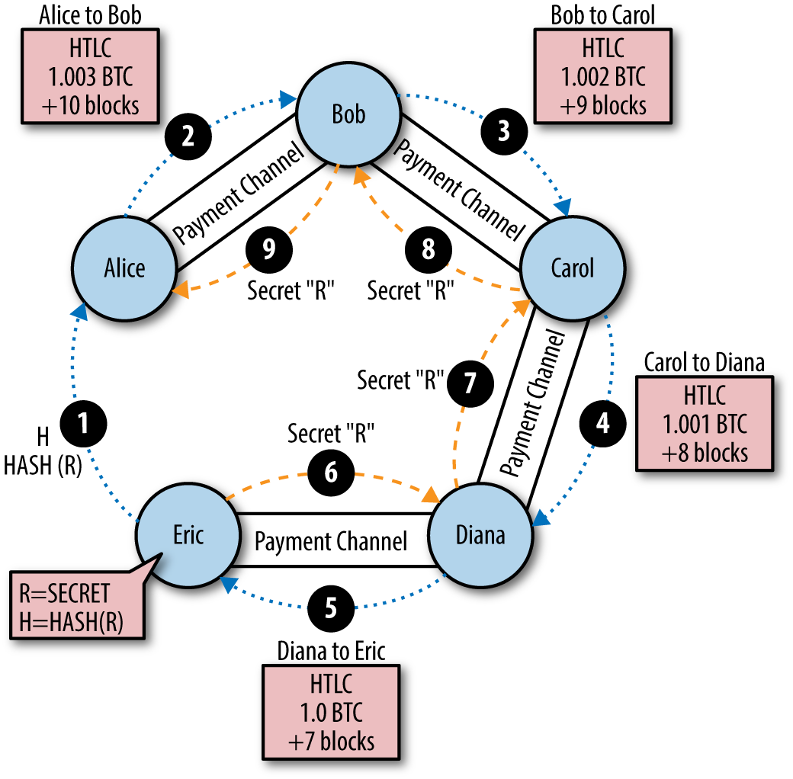

<!--
 * @Author: ZhXZhao
 * @Date: 2020-03-01 16:04:12
 * @LastEditors: ZhXZhao
 * @LastEditTime: 2020-03-03 00:30:49
 * @Description: 
 -->

# Notes of Lighting Network

---


## 状态通道

状态通道是为了解决区块链扩容问题而出现的。

“通道”一词是个比喻，表示由链外双方之间的交换状态代表的虚拟结构。

通过一个交易在区块链上所锁定的共享状态，在交易双方之间建立了一个状态通道。这个交易被叫做“资金交易”或“锚点交易”（Funding Transaction）。这笔交易必须被广播到网络上并被挖矿确认，才能够建立状态通道。在**支付通道**中，锁定的状态为：通道的初始余额。

随后双方交换已签名的交易，这个交易被称为“承诺交易”。承诺交易会改变初始状态，任何一个承诺交易都是有效的。

当交换承诺交易时，双方同时废止之前的状态，只有最新的承诺交易是唯一可以被赎回的交易。

通道可以合作关闭，即向区块链提交最后的结算交易，或者单方面由任何一方提交最后承诺交易到链上。

在通道的整个生命周期中，只有两个交易需要提交给链上进行挖矿：**资金交易和结算交易**。在这两个状态之间，双方可以交换任意数量的承诺交易，其他人不会看到，也不会提交链上。

状态通道的基本组成部分：
1. 区块链通过多个签名和部分智能合约锁定的部分状态。（也就是Funding Transaction）
2. 参与者通过产生签名转账来更新状态，不直接在链上进行计算，每个新的更新会刷新之前的更新。（也就是中间无数次的承诺交易）
3. 最终，参与者将状态传回到区块链上，关闭状态通道，锁定状态。（也就是结算交易）

## 简单的支付通道

先展示一个单向通道，也就是说只能一方向另一方付款。我们假设没有恶意的参与者。

两个参与者：Emma和Fabian。Fabian提供由微支付通道支持以秒为单位时长计费的视频流服务。每秒收费0.01毫比特币。Emma是从Fabian那里使用以秒计费的支付通道来购买流媒体视频服务的用户。

为了设置支付通道，Emma 和Fabian 建立了一个2-2 的多重签名地址，双方各持一个密钥。Emma向该地址提交了1个小时视频的“押金”，也就是36毫比特币，这笔交易就是支付通的资金交易或锚点交易。

资金交易从Emma的钱包中消耗一个或多个输入以集成资金，创建了一个36毫比特币的输出，支付给了Emma和Fabian之间共同控制的多重签名2-2地址。也可能会产生一个找零的输出。

资金交易一旦被确认，Emma可以开始观看视频，Emma的软件创建并签署一个承诺交易，改变通道余额，将0.01毫比特币归入到Fabian的地址，剩余35.99毫比特币退回给Emma，此时该交易只被部分签名，然后Fabian的服务器收到了该交易，会添加第二个签名，然后将其返回给Emma并附上1秒钟的视频。

下一轮，Emma创建并签署第二个承诺交易，该交易从资金交易中消耗相同的2of2输出，分配一个0.02毫比特币到Fabian地址，剩余35.98返回给Emma，Fabian签署该交易并附上另一秒的视频内容返回给Emma。

利用上述方法，Emma的软件持续向Fabian服务器发送承诺交易，以换取流视频。假设Emma观看了600秒的视频，创建并签署了600笔承诺交易，最后的第600号承诺交易将有2个输出，分别是6毫比特币给Fabian，30毫比特币给Emma。

最后，Emma停止了流视频，Fabian或Emma可以发送最终状态的交易进行结算，最后一笔交易即为结算交易。只有两个交易被记录在区块上：建立通道的**资金交易**和两个参与者之间正确分配最终余额的**结算交易**。



## 制造无需信任的通道

现在来看一下可能会破坏这个通道的场景：
1. 一旦资金交易发生，Emma需要Fabian的签名才能给自己找零，若Fabian永不上线，Emma的资金将被永远锁定在2of2的地址中。这个通道一旦建立，如果在双方共同签署至少一个承诺交易之前，有任何一方断开，就会导致资金的流失。
2. 当通道正在运行时，Emma可以采取Fabian已经签署的任何承诺交易，并将它发回链上。比如发送一号交易，以1秒钟的视频花费，获取600秒的视频服务。

这两个问题都可以用时间锁（timelocks）来解决。

**如何使用交易级时间锁（nLocktime）？**
为解决场景1种的问题（有一方掉线了，并不再上线），Emma需同时建立资金交易和退款交易，Emma签署资金交易，但不发送资金交易，只将退款交易发送给Fabian，获得他的签名。**退款交易**作为**第一个承诺交易**，其时间锁确立了通道生命的上限。例如，Emma将nLocktime设置为30天或4320个区块。所有后续的承诺交易都必须要设置成递减的时间锁。

有了退款交易的Emma可以发送签署过的资金交易，然后对于之后的每个承诺交易，都会设置一个稍短的nLocktime（以递减的形式），这样最新的承诺交易可以在被废止的前一个承诺交易之前被赎回。

此方式是使用的绝对的交易级时间锁（nLocktime）。

通过脚本级的时间锁定，CHECKLOCKTIMEVERIFY和CHECKSEQUENCEVERIFY可以构建更加灵活的、有用和复杂的状态通道。

时间锁并不是使先前承诺交易无效的唯一办法，通过撤销密钥可以达到相同的效果。
时间锁的缺点：
- 建立最大时间锁，限制了通道的使用寿命。
- 难以在允许长期通道存活的时间和参与者等待退款的时间之间做平衡。
- 由于后续的承诺交易的时间锁必须递减，所以限制了最大的承诺交易数。而且较短的时间锁间隔会为参与者带来很大的负担，因为参与者需要时刻监视通道。

**合作关闭通道和单方面关闭通道的区别：**
通过广播承诺交易，单方面关闭通道，需要等到承诺交易时间到期。
合作关闭通道可以由任一方建立一个和最后一笔承诺交易相同的结算交易，只不过结算交易没有了时间锁。通过合作签署并广播结算交易，可以立即关闭通道并收到余额。

## 不对称可撤销承诺

一个交易虽然无法被取消，但是可以被构造成无法再使用的样子。通过给予每一方一个**撤销密钥**，如果对方试图欺骗，可以用来惩罚。

**举例说明，什么是撤销密钥？**
在Hitesh和Irene经营的两个交易所之间构建一个复杂的支付通道。
Hitesh和Irene合作建立资金交易来启动通道，每人向通道中注资5个比特币，初始余额为Hitesh有5个比特币，Irene有5个比特币。此时的资金交易没有被签署，也没有被广播。

然后，Hitesh和Irene分别创造了两个不对称的承诺交易。

Hitesh有一个带有两个输出的承诺交易，第一个输出立即支付给Irene 5个比特币，第二个输出支付给Hitesh自己5个比特币，但需要等待1000个区块才能赎回。Hitesh持有的承诺交易由Irene签署。交易如下：

```
Input: 2-of-2 funding output, signed by Irene

Output 0 <5 bitcoin>:
    <Irene's Public Key> CHECKSIG

Output 1:
    <1000 block>
    CHECKSEQUENCEVERIFY
    DROP
    <Hitesh's Public Key> CHECKSIG
```

Irene有一个带有两个输出的承诺交易，第一个输出立即支付给Hitesh 5个比特币，第二个输出支付给Irene自己5个比特币，但需要等待1000个区块才能赎回。Irene持有的承诺交易由Hitesh签署。交易如下：

```
Input: 2-of-2 funding output, signed by Hitesh

Output 0 <5 bitcoin>:
    <Hitesh's Public Key> CHECKSIG

Output 1:
    <1000 block>
    CHECKSEQUENCEVERIFY
    DROP
    <Irene's Public Key> CHECKSIG
```


**那撤销密钥作何作用？**
每一个承诺交易都有一个延迟的输出，该输出允许一方在1000个区块后兑换它，或者另一方如果拥有**撤销密钥**也可以兑换它。

加上了**撤销密钥**，Hitesh的输出脚本变为：

```
Output 0 <5 bitcoin>:
    <Irene's Public Key> CHECKSIG

Output 1:
IF # Revocation penalty output
    <Revocation Public Key>
ELSE
    <1000 block>
    CHECKSEQUENCEVERIFY
    DROP
    <Hitesh's Public Key> CHECKSIG
ENDIF
```

当通道进入下一个状态时，Hitesh必须在Irene同意签署下一个承诺交易之前，撤销此承诺交易：具体做法为将撤销密钥发送给Irene。这样Irene就可以放心签署下一个承诺交易，因为如果Hitesh试图发布之前的承诺交易，Irene可以使用撤销密钥来兑换Hitesh的延迟输出，这样Irene会得到通道内的所有资金。

撤销是双边的，在每一轮中，随着通道状态的发展，双方交换新的承诺交易，交换用于之前承诺交易的撤销密钥，签署彼此的承诺交易。

值得注意的是，撤销不会自动发生，需要参与者勤恳地观察区块链中的作弊现象，如果观察到有先前的承诺交易被广播，那么有1000个区块的时间来通过撤销密钥惩罚作弊者。

## 哈希时间锁合约（Hash Time Lock Contracts, HTLC）

支付通道可以通过哈希时间锁合约进一步扩展，以允许参与者将资金用于可赎回的具有到期时间的秘密（secret）。

首先解释一下HTLC的“哈希”部分。要创建一个HTLC，预期的收款人需要先创建一个秘密（secret）R。然后计算出这个R的哈希值H。这个哈希值H可以包含在输出的锁定脚本中。任何知道秘密的人都可以用此来兑换输出。

HTLC的第二个组件为“时间锁”。如果秘密没有被揭露，HTLC的付款人可以在一段时间后得到退款。这是通过绝对时间锁CHECKLOCKTIMEVERIFY来实现的。HTLC的脚本可能如下：

```
IF
    # Payment if you have the secret R
    HASH160 <H> EQUALVERIFY
ELSE
    # Refund after timeout
    <locktime>
    CHECKLOCKTIMEVERIFY DROP
    <Payee Public Key> CHECKSIG
```

任何知道秘密R的人都可以行使IF语句的第一个子句来兑换输出。如果秘密没有被揭露，在一定时间后，可以使用IF语句中的第二个子句申请退款。

## 可路由的支付通道（闪电网络）

**闪电网络**是一种**端到端连接**的**双向支付通道**的**可路由**网络。这样的网络允许任何参与者穿过一个通道路由到另一个通道进行支付，而不需要信任任何中间人。

**闪电网络是如何工作的？**
我们以五个参与者：Alice, Bob, Carol, Diana, and Eric。参与者之间的支付通道如图所示。假设每个通道每个参与者都注资2个比特币，即每个通道的总容量为4个比特币。



Alice想要支付给Eric一个比特币。但Alice并没有通过支付通道与Eric直接连接。



Alice的LN节点通过互联网连接到Eric的LN节点。Eric使用随机数生成器生成一个秘密R，然后将R的哈希值H发送给Alice的节点。

然后Alice节点构造一个HTLC，支付到哈希H，具有10个区块的退款超时，数量为1.003BTC。额外的0.003作为服务费，付给参与此路由的中间节点。Alice将HTLC提供给Bob，从和Bob的通道余额中扣除1.003BTC，并将其提交给HTLC。该HTLC具有的意义：“如果Bob知道秘密R，Alice将其通道余额的1.003BTC支付给Bob，或者超过10个区块时间后，则退还入Alice的余额。”现在Alice和Bob的承诺交易为：有三个输出，Bob的2比特币余额，Alice的0.997比特币余额，Alice的HTLC中承诺的1.003比特币。

类似地，Bob向Carol提供一个HTLC，其数量为1.002BTC，超时时间为9个区块。更新承诺交易。Carol提供一个1.001BTC，超时时间为8个区块的HTLC给Diana，Diana提供给Eric一个1个BTC，超时时间7个区块的HTLC。

Eric拥有秘密R，Eric将秘密R发送给Diana获取1个比特，Diana将秘密R发送给Carol获取1.001个比特币，类似地，Carol从Bob那里获得1.002个比特币，Bob从Alice那里获得1.003个比特币。

在此情况下，付款线路中的中间方无需互相信任，唯一的风险是，如果通道关闭或路由失败，退款有个短期的延迟。

## 闪电网络传输和路由

LN 节点之间的所有通信都是点对点加密的。另外，节点有一个长期公钥，它们用作标识符并且彼此认证对方。

当一个节点想要向另一个节点发送支付时，利用路由协议，找到具有足够容量的通道构建网络路径。

在Alice与Eric支付的例子中，Alice节点构建路径，传播一系列加密和嵌套的指令来连接每个相邻的支付通道。

路径只有Alice节点知道，中间的参与者只能看到上一跳节点和下一跳节点。这是闪电网络的一个重要特征，因为它确保了付款的隐私。

闪电网络实现了一种基于称为Sphinx 的方案的洋葱路由协议。该路由协议确保支付发送者可以通过闪电网络构建和通信路径，使得：
- 中间节点可以验证和解密其部分路由信息，并找到下一跳。
- 除了上一跳和下一跳，中间节点不能了解作为路径一部分的任何其他节点。
- 中间节点无法识别支付路径的长度，或者他们自己在该路径中的位置。
- 路径的每个部分被加密，使得网络级攻击者不能将来自路径的不同部分的数据包彼此关联。
- 不同于Tor（互联网上的洋葱路由匿名协议），没有可以被监视的“退出节点”。付款不需要传输到比特币区块链，节点只是更新通道余额。

Alice 将路径的每个元素包裹在一层加密中，从尾端开始倒过来运算。Alice用Eric公钥加密给Eric的消息，该消息包裹在Diana公钥加密的消息中，再包裹在Carol的公钥加密消息中，再包裹在Bob的公钥加密消息中。

每个路径元素包含：承载于HTLC的必须扩展到下一跳的信息，HTLC中要发送的数量，要包括的费用以及CLTV锁定到期时间（以块为单位）。

## 闪电网络的优势

如果闪电网络搭建在在比特币网络之上，则比特币网络可以大大**提高容量**，**隐私性**，**粒度**和**速度**，而**不会牺牲无中介机构的无信任操作原则**：
- **隐私**。中间节点不会知道交易的发送人和接收人。
- **流动性**。在比特币网络上应用监视和黑名单变得困难。
- **速度**。HTLC无需提交交易到区块上就可以结算。
- **粒度**。手续费少，可以支付小额比特币。
- **容量**。每秒可以通过闪电网络路由的付费数量没有具体上限。
- **无信任操作**。对等节点无需互相信任。
