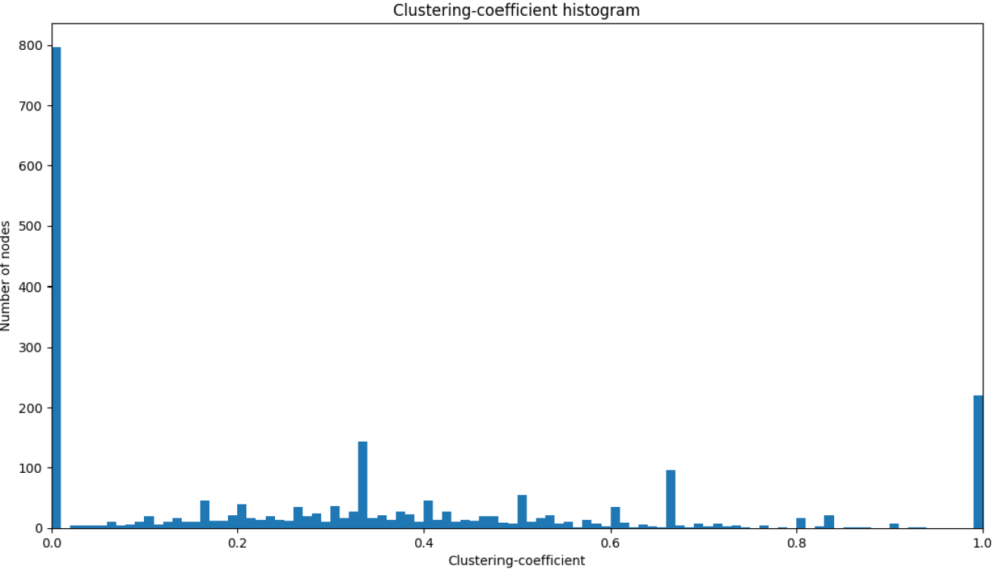

<!--
 * @Author: ZhXZhao
 * @Date: 2020-03-09 14:05:41
 * @LastEditors: ZhXZhao
 * @LastEditTime: 2020-03-09 16:57:10
 * @Description: 
 -->

# Topological Analysis of Bitcoin's Lightning

---

- [Topological Analysis of Bitcoin's Lightning](#topological-analysis-of-bitcoins-lightning)
  - [正文](#%e6%ad%a3%e6%96%87)
  - [闪电网络的拓朴结构](#%e9%97%aa%e7%94%b5%e7%bd%91%e7%bb%9c%e7%9a%84%e6%8b%93%e6%9c%b4%e7%bb%93%e6%9e%84)
  - [闪电网络的鲁棒性](#%e9%97%aa%e7%94%b5%e7%bd%91%e7%bb%9c%e7%9a%84%e9%b2%81%e6%a3%92%e6%80%a7)
    - [随机故障](#%e9%9a%8f%e6%9c%ba%e6%95%85%e9%9a%9c)
    - [目标攻击](#%e7%9b%ae%e6%a0%87%e6%94%bb%e5%87%bb)
    - [改进闪电网络对随机故障和目标攻击的弹性](#%e6%94%b9%e8%bf%9b%e9%97%aa%e7%94%b5%e7%bd%91%e7%bb%9c%e5%af%b9%e9%9a%8f%e6%9c%ba%e6%95%85%e9%9a%9c%e5%92%8c%e7%9b%ae%e6%a0%87%e6%94%bb%e5%87%bb%e7%9a%84%e5%bc%b9%e6%80%a7)

## 正文

本文的贡献：测量并描述了闪电网络的拓扑结构，并展示了它对随机故障和目标攻击的鲁棒性。这些结果表明，闪电网络的拓扑结构可以被改进以实现其真正的潜力。

## 闪电网络的拓朴结构

闪电网络可以被描述为一个带权图$G=(V, E)$，$V$是闪电网络中节点集合，$E$是双向通道集合。

这篇文章中截取了一个2019年1月3日的闪电网络快照。然后以此进行分析。

在闪电网络中，尽管节点数和通道数一直是动态变化的，但是网络的拓扑结构（密度，平均度，传递性，度分布）是不变的。

2019年1月3日的闪电网络的基础属性，如下表所示。
|Property|Value|
|---|---|
|Number of nodes|2344|
|Number of payment channels|16617|
|Average degree|7.0891|
|Connected components|2|
|Density|0.00605|
|Total BTC held in LN|543.61855 BTC|
|s-metric|0.6878|
|Maximal independent set|1564|
|Bridges|530|
|Diameter|6|
|Radius|3|
|Mean shortest path|2.80623|
|Transitivity|0.1046|
|Average clustering coefficient|0.304|
|Degree assortativity|-0.2690|

Density（密度）定义如下：
$$D=\frac{2|E|}{|V||V-1|}$$
即，现有的边和一共可能存在的边的比值。
Bridge（桥）的定义：bridge是一条边，删除bridge会增加连通子图的个数。
Transitivity（传递性）的定义：认识同一个节点的两个节点也可能认识双方的概率。
Degree assortativity（度同配性）的定义：用来考察度值相近的节点是否倾向于相连。取值范围为[-1, 1]。正值代表具有相同度的点之间有某种协同关系，负值表示具有不同度数的节点间有某种联系。

从**density的值很小**，**有很多条bridge**，和很**低的transitivity**可以显示出，闪电网络是一个很稀疏的图。

从degree assortativity是负值可以显示出，低度的节点更倾向于去与高度的节点相连。这样的异配性（同配值为负）暗示出网络是一个hub and spoke（中心辐射型）网络结构。这也可以表明，网络中节点的度分布是低度节点数量很多，高度节点数量很少。

Mean shortest path（平均最短路径）为2.80623，意味着支付可以通过简单的几跳路由就贯穿网络。但这里没有考虑支付通道的容量，因此并不能这么简单的考虑。

Local clustering coefficient衡量一个节点的邻居节点之间互相连接的程度，也就是说邻居们结成一个簇的接近程度。还可以说是，**一个节点的邻居之间也是邻居的程度（邻居圈子重合程度）**。计算方式类似于密度的计算方式，是一种局部密度的计算。闪电网络的Local clustering coefficient分布（下图）显示出，闪电网络本质上是由一个小的中心团和一个松散连接的外围组成。

s-metric用来表示一个网络的无标度程度，s-metric越接近1，网络的无标度程度越大。闪电网络有无标度特性。
小世界网络，特点：高聚类系数（clustering coefficient），低平均最短路径（Mean shortest path）。闪电网络符合小世界网络的特性。

## 闪电网络的鲁棒性

渗透阈值（percolation threshold）：致使网络的极大连通子图的大小崩塌至1%以下，所需移除网络中节点的分数。

### 随机故障

|Network|$f_c$|
|---|---|
|Internet|0.92|
|WWW|0.88|
|US Power Grid|0.61|
|Mobil Phone Call|0.78|
|Science collaboration|0.96|
|E. Coli Metabolism|0.96|
|Yeast Protein Interactions|0.88|
|LN|0.96|

从上表可以看出，闪电网络（LN）对于随机故障有很大的容忍，随机故障下网络的拓扑结构依然很稳定。这是由于网络中的大多数节点对于网络的拓扑连接性贡献不是很大。

### 目标攻击

通过泛洪HTLCs，对特定的节点发动DDos攻击。

|Network|$f_c$|
|---|---|
|Internet|0.16|
|WWW|0.12|
|US Power Grid|0.20|
|Mobil Phone Call|0.20|
|Science collaboration|0.27|
|E. Coli Metabolism|0.49|
|Yeast Protein Interactions|0.16|
|LN|0.14|

从上表可以看出，闪电网络（LN）对于特定的目标攻击鲁棒性很差。
通过实验发现，按照最高度节点攻击的$f_c=0.1627$，按照最高中间中心性（betweenness centrality）节点攻击的$f_c=0.1409$。所以在**无防御策略的情况下**，针对高中间中心性节点的攻击是更有效的。

### 改进闪电网络对随机故障和目标攻击的弹性

应用[(1,0) Network](../(1,0)%20Network/Optimization%20of%20robustness.pdf)中的优化策略，来优化闪电网络的拓扑结构是可能的。

还可以通过要求闪电网络客户端，在有新节点加入网络时，不仅要与hub节点相连，还要至少连接到几个随机的节点。
