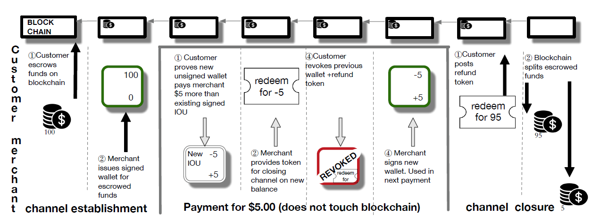
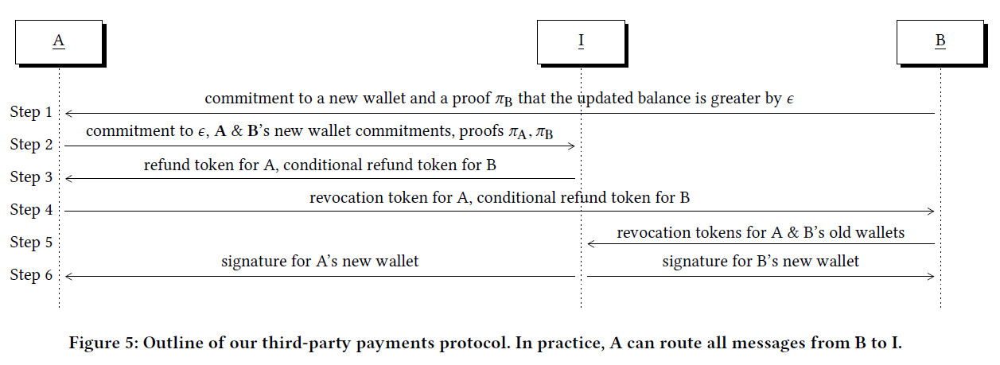

<!--
 * @Author: ZhXZhao
 * @Date: 2020-12-05 17:35:00
 * @LastEditors: ZhXZhao
 * @LastEditTime: 2020-12-06 21:09:31
 * @Description: file content
-->
# Bolt: Anonymous Payment Channels for Decentralized Currencies

## 正文

本文的贡献：
1. 构造了三种匿名的支付通道，三种支付通道分别为：1）单向的支付通道，2）双向的支付通道，3）支付通道链。
2. 实现了双向支付通道方案，并在ZCash上以软分叉的方式部署了该方案。

## 问题背景

支付通道的出现解决了比特币的可扩展性问题，但是支付通道仍存在一些隐私问题，如，**任何人都可以知道通道建立时和关闭时通道双方的余额，通过中间节点路由会泄露交易相关信息**。

## 三种方案

### 单向支付通道

#### “strawman”协议

1. 商家在确定顾客向通道中“注资”后，为顾客发行一个包含匿名币的钱包，顾客可用改钱包中的钱来向商家支付。
2. 关闭通道时，顾客将剩余的钱付给自己，并将剩余的钱都广播到区块链中。

“strawman”协议存在的问题：1）关闭通道很麻烦，需要客户将所有剩余的资金都广播。2）商家需要等到顾客的资金被确认到通道中才能发行钱包，顾客也无法确定在自己向通道中注资后，商家会不会发行钱包给自己。3）商家有可能向自己发行币来伪造顾客进行了双重花费的假象。

改进：为解决第一个问题，改用紧凑型电子现金方案，B个币可以从固定大小的钱包中生成出来。

J = B – N + 1，N为客户剩余的币个数，Kj是第j个密文的密钥，这样密文Cj, … , CN都可以被解密出来。
商家检查密钥是否有效，密文解密出来的币是否有效，是否有双重花费发生。

#### 单向支付通道协议

1. 改用紧凑型电子现金方案。
2. 在创建通道时，将钱包的承诺和抵押资金都广播到支付网络。
3. 支付时，生成B个币，为每个币创建零知识证明，证明该币与该通道中钱包的承诺是绑定的；将产生的交易加密并将密文和下一个密文的密钥嵌入到花费交易中。然后签名加密的交易并发送给商家报关。
4. 关闭通道时，客户广播(channel ID, j, kj)。

#### 双向支付通道协议

单向支付通道存在的问题是交易只能单方向进行，并且交易金额是固定大小的。所以引入了双向支付通道。
但双向支付通道在关闭通道的时候会面临一个两难的境地：如果商家在旧钱包失效之前签署了新的钱包，顾客可以同时使用旧钱包和新钱包中的钱；如果商家在签署一个新的钱包之前就使得旧钱包失效了，那么如果商家一直拒绝签署新的钱包，那么顾客就一直无法取回自己的钱。
所以引入了一个refund token，来使得旧钱包失效。（类似闪电网络中的撤销密钥）

#### 支付通道链

为保证支付的原子性，需要为B的退款token添加两个条件，一个条件是B必须一个对于A的前一个钱包的撤销信息，该条件保证了当I支付给B后，A不能撤销交易了，因为I有撤销信息。另一个条件是，A没有将包含wsk的撤销token发送到公共总账上，如果A支付给I的交易撤销了，B就强制I支付给B。隐藏支付金额，就是通过发送对支付金额的承诺，来隐藏。（B就是商家）

