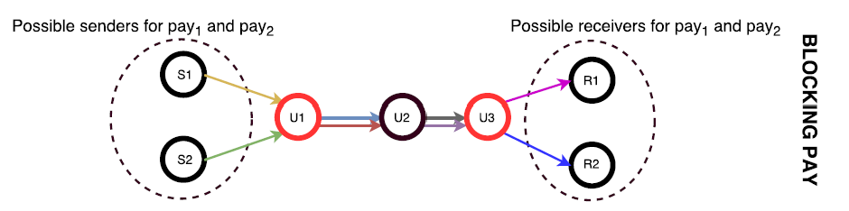
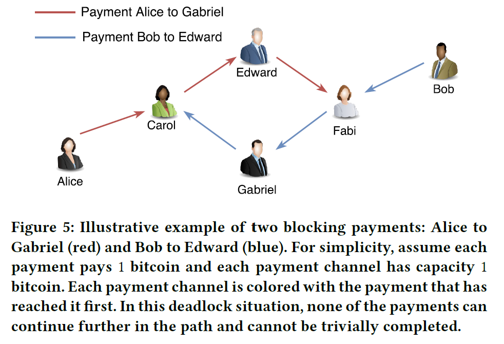
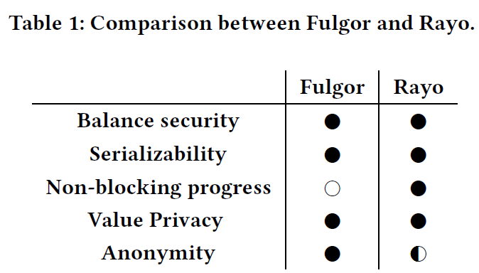
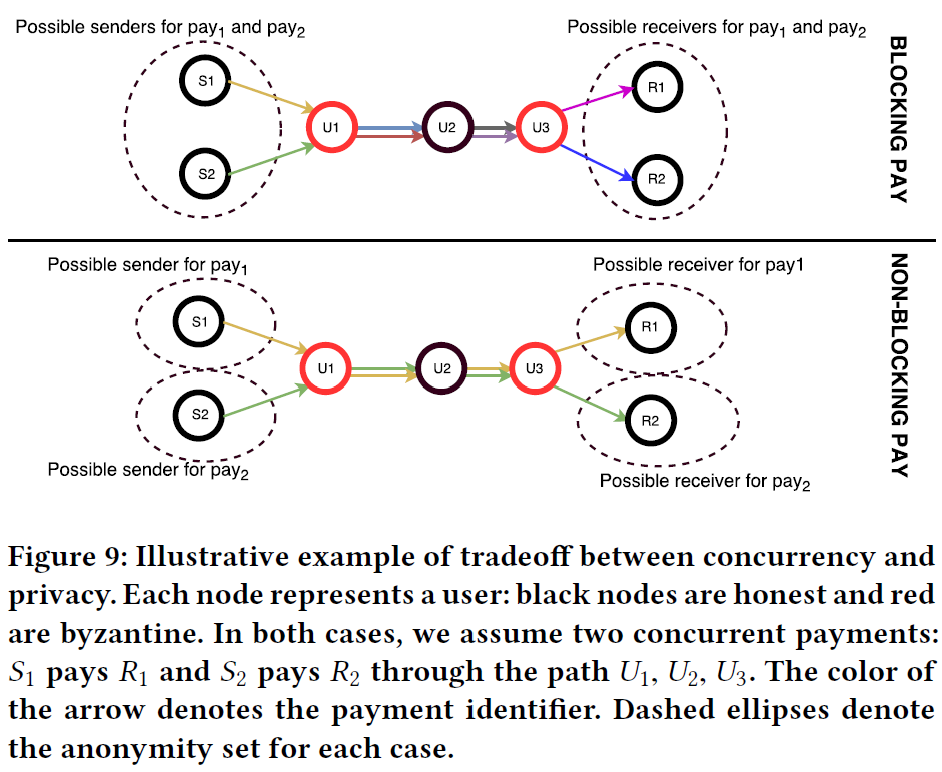

<!--
 * @Author: ZhXZhao
 * @Date: 2020-07-19 16:24:25
 * @LastEditors: ZhXZhao
 * @LastEditTime: 2020-07-20 11:46:31
 * @Description:
-->

# Concurrency and Privacy with Payment-Channel Networks

---

- [Concurrency and Privacy with Payment-Channel Networks](#concurrency-and-privacy-with-payment-channel-networks)
  - [正文](#正文)
  - [定义](#定义)
  - [Multi-Hop HTLC](#multi-hop-htlc)
  - [FULGOR协议](#fulgor协议)
  - [Rayo协议](#rayo协议)

## 正文

文章的贡献：
- 首次形式化地定义了支付通道网络（PCN）中的**安全和隐私**的概念。安全具体指**余额安全**（balance security），隐私具体指**交易金额隐私**（value privacy）和**关系隐私**（sender/receiver anonymity）。
- 首次研究了PCNs中的并发问题，提出了两种协议：**Fulgor**和**Rayo**。Fulgor是阻塞协议，在发生并发支付的时候可能导致死锁。Rayo是非阻塞协议，在冲突发生时，会保证至少有一笔支付成功执行。
- 提出了一个Multi-Hop HTLC智能合约。

## 定义
**余额安全**（balance security）：任何参与支付的诚实节点都不会丢失金钱，即便所有其他参与支付的节点都是恶意的。
**交易金额隐私**（value privacy）：当一个支付涉及的用户都是诚实的时候，支付路径外的恶意用户是无法知晓任何有关支付金额的信息的。
**关系隐私**（sender/receiver anonymity）：当有两个交易通过同一条支付路径进行路由时，当支付路径中至少有一个诚实的中间节点时，恶意的中间节点无法以大于1/2的概率区分出$(s_i,r_i)$，即无法确定交易是哪个发送者发给哪个接收者。

## Multi-Hop HTLC
不同于HTLC（HTLC，同一笔支付，在支付路径中的哈希值都是相同的），Multi-Hop HTLC的同一笔支付，在每个中间节点中哈希值都是不同的。
具体做法：若一笔支付，从第一个中间节点到接收者，共涉及n个节点，则发送者先随机生成n个字符串$x_i$，并计算$x_i$相应的哈希值$y_i=H(\bigoplus_{j=1}^n x_j)$。同时发送者还会计算一个零知识证明$\pi$，来证明发送的$x_i$和$y_i$是well-formed的，没有泄露所有的$x_i$。
对于接收者，发送者只发送$(x_n,y_n)$，接收者只需要简单地验证$y_n=H(x_n)$即可。对于中间节点，发送者要给每个中间节点都发送$(x_i,y_i,\pi_i)$，而后中间节点利用零知识证明$\pi_i$验证$x_i$和$y_i$是well-formed。这样即可实现同一笔支付，在每个中间节点中哈希值都是不同的，而且前继节点只有等后继节点揭露了x值后才能计算出当前的哈希值原像。

## FULGOR协议

FULGOR是一个阻塞协议，当死锁发生时，就将涉及到死锁的支付全部终止，被终止的支付的发送者，随机选择一个时间后重新发送支付。
死锁情况如下图所示：

## Rayo协议

Rayo是一个非阻塞的协议。在Rayo协议当中，为每个交易都设置一个全局的状态（也可以理解为优先级），当死锁发生时，终止优先级低的交易，继续优先级高的交易。
作为代价，全局状态的设置会牺牲一些关系匿名性。

损失关系匿名性的示例：

