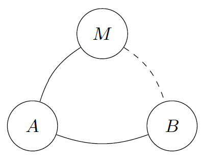

<!--
 * @Author: ZhXZhao
 * @Date: 2020-06-29 23:14:46
 * @LastEditors: ZhXZhao
 * @LastEditTime: 2020-06-29 23:30:14
 * @Description:
-->
# Improvements of the Balance Discovery Attack on Lightning Network Payment Channels

---

## 贡献
发表在asiaCCS2019的文章《On the Difficulty of Hiding the Balanceof Lightning Network Channels》中提出了一种揭露闪电网络中通道余额的攻击方法，但是这种攻击方法受限于MAX_PAMENT_ALLOWED，当通道中的余额值大于MAX_PAMENT_ALLOWED时，这种攻击就无法揭露出通道中余额的详细值，只能知道余额的下限。

介于这种限制，在这篇文章中，提出了一种改进版的揭露通道余额的攻击方式，即为双向的揭露攻击。具体方式为：**当攻击者M从A发起交易来揭露AB中的通道余额时，发现A的余额要大于MAX_PAMENT_ALLOWED，此时攻击者M会尝试通过与B建立通道，再次发起揭露余额攻击。**注意：*这种方法也只能揭露通道容量是小于2\*MAX_PAMENT_ALLOWED的，因为当通道容量大于2\*MAX_PAMENT_ALLOWED，通道双方的余额都大于MAX_PAMENT_ALLOWED。*

文章还对三种主流的闪电网络客户端实现进行了分析：c-lightning，eclair和lnd。他们之中只有c-lightning是严格按照BOLT的规范实现的，所以不同实现方法的客户端之间建立的通道是有不同规则的，这就引发了一个关闭通道的攻击。当交易的支付金额大于MAX_PAMENT_ALLOWED时，c-lightning会关闭通道。
