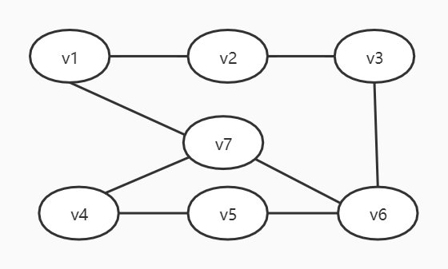
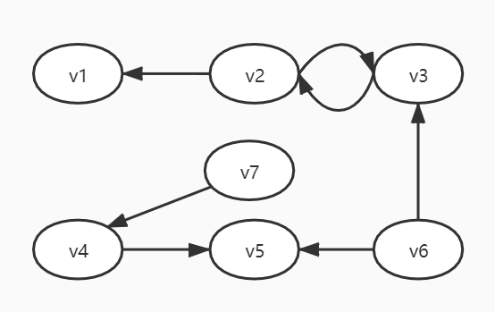
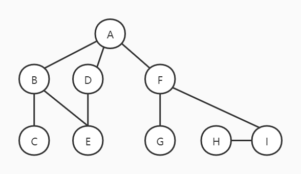

<!--
 * @Author: ZhXZhao
 * @Date: 2020-03-05 11:04:00
 * @LastEditors: ZhXZhao
 * @LastEditTime: 2020-03-09 16:57:20
 * @Description: 
 -->

# On the robustness of Lightning Network in Bitcoin

---

- [On the robustness of Lightning Network in Bitcoin](#on-the-robustness-of-lightning-network-in-bitcoin)
  - [先验知识](#%e5%85%88%e9%aa%8c%e7%9f%a5%e8%af%86)
    - [连通图](#%e8%bf%9e%e9%80%9a%e5%9b%be)
    - [社区网络](#%e7%a4%be%e5%8c%ba%e7%bd%91%e7%bb%9c)
    - [节点中心性（centrality）度量](#%e8%8a%82%e7%82%b9%e4%b8%ad%e5%bf%83%e6%80%a7centrality%e5%ba%a6%e9%87%8f)
  - [正文](#%e6%ad%a3%e6%96%87)
  - [背景介绍](#%e8%83%8c%e6%99%af%e4%bb%8b%e7%bb%8d)
  - [仿真模型](#%e4%bb%bf%e7%9c%9f%e6%a8%a1%e5%9e%8b)
    - [攻击策略](#%e6%94%bb%e5%87%bb%e7%ad%96%e7%95%a5)
      - [随机攻击](#%e9%9a%8f%e6%9c%ba%e6%94%bb%e5%87%bb)
      - [高degree攻击](#%e9%ab%98degree%e6%94%bb%e5%87%bb)
      - [高中心性攻击](#%e9%ab%98%e4%b8%ad%e5%bf%83%e6%80%a7%e6%94%bb%e5%87%bb)
      - [基于社区的攻击](#%e5%9f%ba%e4%ba%8e%e7%a4%be%e5%8c%ba%e7%9a%84%e6%94%bb%e5%87%bb)
    - [防御策略](#%e9%98%b2%e5%be%a1%e7%ad%96%e7%95%a5)
      - [随机防御](#%e9%9a%8f%e6%9c%ba%e9%98%b2%e5%be%a1)
      - [优先防御](#%e4%bc%98%e5%85%88%e9%98%b2%e5%be%a1)
      - [平衡防御](#%e5%b9%b3%e8%a1%a1%e9%98%b2%e5%be%a1)
    - [网络配置](#%e7%bd%91%e7%bb%9c%e9%85%8d%e7%bd%ae)
  - [仿真结果](#%e4%bb%bf%e7%9c%9f%e7%bb%93%e6%9e%9c)
  - [思考](#%e6%80%9d%e8%80%83)

## 先验知识

### 连通图

**连通**：在一个无向图G中，若从顶点i到顶点j有路径相连，则称i和j是连通的。如果G是有向图，那么连接i和j的路径中所有的边都必须同向。
**连通图**：如果图中任意两点都是连通的，那么图被称为连通图。
**连通分量**：无向图G的一个极大连通子图称为G的一个连通分量。连通图只有一个连通分量，即其自身；非连通的无向图有多个连通分量。
**连通度**：1）**点连通度**：一张连通图G最少删除多少个顶点后使得G不连通，设删除顶点数为m，则称图G的点连通度为$K(G)=m$。删除顶点集$V^{'}$后，$G-V^{'}$不连通，则$V^{'}$为G的顶点割集，点数最少的顶点割集为最小顶点割，其顶点个数即为点连通度。若G不连通，则$K(G)=0$。2）**边连通度**：一张连通图G最少删除多少条边后使得G不连通，设删除边数m，则称图G的边连通度为$\lambda (G)=m$。若G不连通或G是平凡图，则定义$\lambda (G)=0$。

### 社区网络

**社区网络**：由节点和边组成的结构。节点表示个人或组织，边表示用户和用户之间的关系，如果对这些关系强度进行区分的话，我们可以为每条边赋予一个权重，权值越大表示关系强度越大。
**社区**：是指网络中的一些密集群体。每个社区内部的节点间的联系相对紧密，各个社区之间的连接相对比较稀疏。
**社区结构**：真实复杂网络所普遍具有的一个重要拓扑特性。复杂网络可以自然地分成一些节点组，使同一个节点组内的两个节点之间比不同节点组的两个节点之间更倾向于有边相连，网络的这种拓扑特性被称为社区结构。刻画了网络中连边关系的局部聚集特性，体现了网络中连边的分布不均匀性。
**社区发现**：给定一个网格图，找出社区结构的过程叫做社区发现。
**模块度**：评估一个**社区网络划分好坏的度量方法**，**它的物理含义是社区内节点的连边数与随即情况下的边数之差**，取值范围[-1/2, 1)，定义如下：
$$ Q=\frac{1}{2m}\sum_{ij}[A_{ij}-\frac{k_ik_j}{2m}]\delta(c_i,c_j) \\ 
\delta(u,v)=\begin{cases}
    1 & when \ u==v \\
    0 & else
\end{cases} $$

$A_{ij}$表示节点i和j之间的权重；$k_i=\sum_jA_{ij}$表示所有与节点i相连的边的权重之和；$c_i$表示节点i所在的社区；m表示所有边的权重之和。
公式可化简为$Q=\sum_c[\frac{\sum in}{2m}-(\frac{\sum tot}{2m})^2]=\sum_c [e_c-a_c^2]$
这样模块度可理解为**社区内部边的权重减去所有与社区节点相连的边的权重和**，对于无向图来说，即**社区内部边的度数减去社区内节点的总度数**。
**Louvain社区发现算法**：
目标是最大化模块度Q。
过程：
1. 将图中的每个节点看成一个独立的社区，次数社区的数目与节点个数相同；
2. 对每个节点i，依次尝试把节点i分配到其每个邻居节点所在的社区，计算分配前与分配后的模块度变化$\Delta Q$，并记录$\Delta Q$最大的那个邻居节点，如果$max\Delta Q>0$，则把节点i分配到$\Delta Q$最大的那个邻居节点所在的社区，否则保持不变；
3. 重复2），直到所有节点的所属社区不再变化；
4. 对图进行压缩，将所有在同一个社区的节点压缩成一个新节点，社区内节点之间的边的权重转化为新节点的环的权重，社区间的边权重转化为新节点间的边权重；
5. 重复1）直到整个图的模块度不再发生变化。

### 节点中心性（centrality）度量

**中心性（centrality）**：哪个节点的影响力更大

**中心性度量方法：Degree**
一个节点的度（degree）越大，就意味着这个节点的度中心性越高，该节点在网络中就越重要。

**中心性度量方法：Eigenvector**
一个节点的重要性既取决于其邻居节点的数量（即该节点的度），也取决于其邻居节点的重要性。

$$ c(v_7)=\frac{1}{\lambda}[c(v_1)+c(v_4)+c(v_6)] $$
可以看出，$v_7$节点的重要性，是由和它相连的$v_1$,$v_4$,$v_6$三个节点的重要性来决定的,$ \lambda $为邻接矩阵的特征根。

**中心性度量方法：Katz**
Eigenvector在无向图的表现上较好，但在有向图中，节点的eigenvector centrality可能为0。

$$ c(v_5)=\beta \\ c(v_5)=\alpha * [c(v_4)+c(v_6)]+\beta$$

**中心性度量方法：PageRank**
PageRank算法在Katz的基础上，假设一个节点的出度是n，每条出边附上1/n的起始节点的中心度量值。

$$ c(v_5)=\beta \\ c(v_5)=\alpha * [1 * c(v_4)+\frac{1}{2} * c(v_6)]+\beta$$

**中心性度量方法：Betweenness（本文中用到的方法）**
对于网络中的两个节点A和B，他们之间的最短路径可能有很多条。计算网络中任意两个节点的所有最短路径，如果这些最短路径中有很多条都经过了某个节点，那么就认为这个节点的Betweenness Centrality高。
$$ C_b(v_i)=\sum_{s\neq t \neq v_i} \frac{\sigma_{st}(v_i)}{\sigma_{st}} \\ \sigma_{st}：从节点s到t的最短路径数目 \\ \sigma_{st}(v_i)：从节点s到t的，且经过v_i的最短路径数目 $$

直观来讲，图中左边的这些节点和右边这些节点都必须通过A、F两个点来连接，因此A、F两点的betweenness centrality会更高。

**中心性度量方法：Closeness**
思想是：如果节点到图中其他节点的最短距离都很小，则认为该节点的Closeness centrality很高。
$$ C_c(v_i)=\frac{1}{\overline{l}_{v_i}} \\ \overline{l}_{v_i}=\frac{1}{n-1}\sum_{v_j \neq v_i}l_{i,j} \\ l_{i,j}：从节点v_i到节点v_j的最短路径长度 $$
从几何角度来看，Closeness centrality高的节点到其他节点的平均最短距离最小，也就是说这个节点位于图的中心位置。

## 正文

文章的主要贡献：对比特币闪电网络的拓扑结构进行了分析，发现比特币闪电网络易受一些针对特定目标节点（高度（degree）的节点，高中心性（centrality）的节点等）的DDos攻击。提出了4种攻击模式：1）随机选择节点攻击，2）选择高度节点攻击，3）选择高中心性节点攻击，4）基于社区的攻击。3种防御策略：1）随机选择与新节点相连，2）选择高度节点与新节点相连，3）选择高中心性节点与新节点相连。通过实验，模拟了攻防过程，并采用控制变量法进行了多次实验，对实验结果进行了分析，实验性地发现了比特币闪电网络易受针对特定目标节点的DDos攻击，采用高度节点攻击可以很有效的切断比特币闪电网络的联系，采用选择高中心性节点与新节点相连的防御策略可以有效地防御攻击。

## 背景介绍
闪电网络的网络拓扑结构类似于internet，万维网等，都具有无标度的特性，即网络中节点的degree分布呈幂律分布。（即少数节点具有很高的degree，大多数节点具有很低的degree）。因此如果攻击者选择具有具有高degree的节点进行DDos攻击的话，网络的连通性会急剧下降。而比特币闪电网络是开放式网络，攻击者很容易了解到网络的拓扑结构，也就是很容易找到高degree的节点。

## 仿真模型

以攻击一轮防守一轮这样交替形式的框架，来模拟对比特币闪电网络的攻击和防御。攻击者的目的是最大化地降低网络的连通性。防御者的目的是尽可能地减少攻击者的破坏。
在攻击阶段，攻击者根据一定策略移除$k_a$个节点，与其连接的边也相应地被移除。
在防御阶段，防御者添加进$k_d$个新节点，并按照一定的策略选择网络中的m个节点连接。m被设置为$m=Round(w*d(G))$
其中$w$为边的权重，$d(G)$表示现在网络中节点的平均degree，$Round()$为四舍五入函数。
评估网络鲁棒性（连通性）的四个指标：1）平均degree，2）极大连通图的大小（LCC），3）平均连通度。

### 攻击策略

#### 随机攻击
从网络中随机选择$k_a$个节点移除。攻击者无需知道网络的拓扑结构。

#### 高degree攻击
从网络中选择$k_a$个最高degree的节点移除。攻击者需要知道网络的拓扑结构。

#### 高中心性攻击
从网络中选择$k_a$个最高中心性（betweenness centrality）的节点移除。攻击者需要知道网络的拓扑结构。

#### 基于社区的攻击
从网络中一共选择$k_a$个节点移除，依次从各个社区中移除最高degree的节点。攻击者需要知道网络的拓扑结构。

### 防御策略

#### 随机防御
随机选择m个节点与新补充的$k_d$个节点相连。防御者无需知道网络的拓扑结构。

#### 优先防御
选择m个最高degree的节点与新补充的$k_d$个节点相连。防御者需要知道网络的拓扑结构。

#### 平衡防御
选择m个最低中心性的节点与新补充的$k_d$个节点相连。防御者需要知道网络的拓扑结构。

### 网络配置
||节点数|边数|直径|密度|平均degree|LCC大小|平均最短路径长度|
|---|---|---|---|---|---|---|---|
|主网|1211|5277|8|0.007|8.715|1194|1.039|
|测试网|1898|4289|8|0.002|4.520|1865|1.097|

## 仿真结果

仿真结果表明，**高degree攻击**具有最好的攻击效果，**平衡防御**具有最好的防御效果。

## 思考
在这篇文章中仅仅考虑了闪电网络的拓朴结构，而没有考虑闪电网络中其他的重要参数，如通道容量，网络的通信时间等等。如果将这些参数考虑进去，建立一个更加完善的模型来仿真闪电网络的攻防，应该会更加贴近实际效果。

