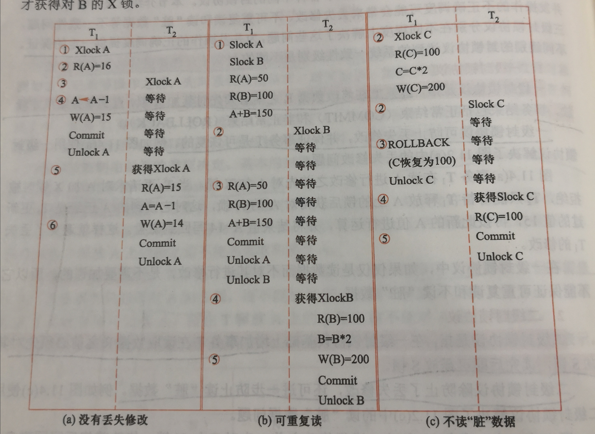
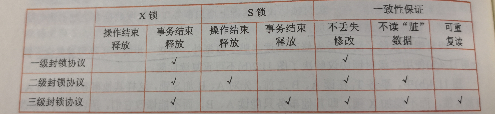

# ACIDRain: Concurrency-Related Attacks on Database-Backed Web Applications

## 先验知识

### 数据库事务的四个特性(ACID)

1. 原子性(A: Atomicity)
事务是数据库的逻辑工作单位，事务中包括的诸操作要么都做，要么都不做。
2. 一致性(C: Consistency)
事务执行的结果必须是使数据库从一个一致性状态变到另一个一致性状态。一致性与原子性是密切相关的。
3. 隔离性(I: Isolation)
一个事务的执行不能被其他事务干扰。即一个事务的内部操作及使用的数据对其他并发事务是隔离的，并发执行的各个事务之间不能互相干扰。
4. 持久性(D: Durability)
一个事务一旦提交，它对数据库中数据的改变就应该是永久性的。

事务是恢复和并发控制的基本单位，保证事务ACID特性是事务管理的重要任务。事务ACID特性可能遭到破坏的因素有：

1. 多个事务并行运行时，不同事务的操作交叉执行；

2. 事务在运行过程中被强行停止。

### 并发操作带来的问题

1. 丢失修改(lost update)

<table>
    <tr>
        <th>T1</th>
        <th>T2</th>
    </tr>
    <tr>
        <td>(1)R(A)=16</td>
        <td></td>
    </tr>
    <tr>
        <td>(2)</td>
        <td>R(A)=16</td>
    </tr>
    <tr>
        <td>(3)A<-A-1</td>
        <td></td>
    </tr>
    <tr>
        <td>W(A)=15</td>
        <td></td>
    </tr>
    <tr>
        <td>(4)</td>
        <td>A<-A-1</td>
    </tr>
    <tr>
        <td></td>
        <td>W(A)=15</td>
    </tr>
</table>

2. 脏读(dirty read)

<table>
    <tr>
        <th>T1</th>
        <th>T2</th>
    </tr>
    <tr>
        <td>(1)R(C)=100</td>
        <td></td>
    </tr>
    <tr>
        <td>C<-C*2</td>
        <td></td>
    </tr>
    <tr>
        <td>W(C)=200</td>
        <td></td>
    </tr>
    <tr>
        <td>(2)</td>
        <td>R(C)=200</td>
    </tr>
    <tr>
        <td>(3)ROLLBACK</td>
        <td></td>
    </tr>
    <tr>
        <td>C恢复为100</td>
        <td></td>
    </tr>
    <tr>
        <td></td>
        <td>读到的C与 数据库中 内容不一致</td>
    </tr>
</table>

3. 不可重复读(non-repeatable read)

<table>
    <tr>
        <th>T1</th>
        <th>T2</th>
    </tr>
    <tr>
        <td>(1)R(A)=50</td>
        <td></td>
    </tr>
    <tr>
        <td>R(B)=100</td>
        <td></td>
    </tr>
    <tr>
        <td>求和=150</td>
        <td></td>
    </tr>
    <tr>
        <td>(2)</td>
        <td>R(B)=100</td>
    </tr>
    <tr>
        <td></td>
        <td>B<-B*2</td>
    </tr>
    <tr>
        <td></td>
        <td>W(B)=200</td>
    </tr>
    <tr>
        <td>(3)R(A)=50</td>
        <td></td>
    </tr>
    <tr>
        <td>R(B)=200</td>
        <td></td>
    </tr>
    <tr>
        <td>求和=250</td>
        <td></td>
    </tr>
    <tr>
        <td>（验算不对）</td>
        <td></td>
    </tr>
</table>

4. 幻读(phantom row)
    1. 事务T1按一定条件从数据库中读取了某些数据记录后，事务T2删除了其中部分记录，当T1再次按相同条件读取数据时，发现某些记录神秘地消失了
    2. 事务T1按一定条件从数据库中读取了某些数据记录后，事务T2插入了一些记录，当T1再次按相同条件读取数据时，发现多了一些记录。

并发控制的主要技术：**封锁**、时间戳、乐观控制法和多版本并发控制。

### 封锁

基本的封锁类型：排他锁（X锁）和共享锁（S锁）

<b>排他锁（写锁）</b>若事务T对数据对象A加上X锁，则只允许T读取和修改A，其他任何事务都不能再对A加任何类型的锁，直到T释放A上的锁为止。<b>这就保证了其他事务在T释放A上的写锁之前不能再读取和修改A。</b>

<b>共享锁（读锁）</b>若事务T对数据对象A加上S锁，则事务T可以读A但不能修改A，其他事务只能再对A加S锁，而不能加X锁，直到T释放A上的S锁为止。<b>这就保证了其他事务可以读A，但在T释放A上的S锁之前不能对A做任何修改。</b>

### 封锁协议

1. 一级封锁协议
一级封锁协议是指，事务T在修改数据R之前必须先对其加X锁，**直到事务结束**（正常结束COMMIT和非正常结束ROLLBACK）**才释放**。**一级封锁协议可防止丢失修改。**
2. 二级封锁协议
二级封锁协议是指，在一级封锁协议基础上增加事务T在读取数据R之前必须先对其加S锁，**读完后即可释放S锁**。**二级封锁协议除防止了丢失修改，还可进一步防止读脏数据。**
3. 三级封锁协议
三级封锁协议是指，在一级封锁协议的基础上增加事务T在读取数据R之前必须先对其加S锁，**直到事务结束才释放**。**三级封锁协议除了防止丢失修改和读脏数据外，还进一步防止了不可重复读。**

上图：使用封锁机制解决三种数据不一致性的示例

 

上图：不同级别的封锁协议和一致性保证

### 隔离等级

1. 读未提交(Read Uncommitted)：对应一级封锁协议

2. 读已提交(Read Committed)：对应二级封锁协议

3. 可重复读(Repeatable Read)：对应三级封锁协议

4. 串行化(Serializable)：事务不可并发执行

上图：隔离等级对应解决的数据不一致性问题（N代表该隔离等级下不存在该数据一致性问题，Y代表存在）

## 正文

文章的贡献：分析了广受欢迎的电子商务网站，发现了22个新的由于没有正确使用事务而引发的漏洞。

### 提出问题

对于电商网站来说，有一个优惠券（只能使用一次），此时一个用户先查询优惠券的使用状态，返回是“未使用”的状态，在使用该优惠券（即将使用状态置为“已使用”）之前，又做了一次优惠券使用状态的查询，那么此时返回的仍是“未使用”状态，这就意味着该优惠券又可以被使用一次，这就造成了优惠券的复用，导致电商网站的财产损失。这就是由事务并发的执行可能带来的危害。

这个漏洞发生的原因可能是：1）数据库提供的隔离等级过弱，也就意味着数据库没有提供保证这种并发所引发的问题不能够出现。2）程序员在编程的时候没有正确的将代码用事务进行封装。（也就是没有正确地放置“beginTxn()”和“commit()”的位置）

### 提出方案

分析方案面临的挑战：1）多个电子商务网站是由多种不同的语言和框架完成的。2）异常通常在并发执行的条件下发生，而网站的活动通常都是串行执行的。

本文提出的方案名为：Abstract Anomaly
Detection(2AD)

方案分为三步：

1. 从数据库中收集日志

2. 建立抽象历史图（abstract history graph)

3. 从抽象历史图中找出非平凡的环，继而生成可能存在并发异常的**API调用组**

2AD步骤

#### 构建抽象历史图

构建规则：用圆圈代表一个读或写操作，用方框代表一个事务，用虚线框代表一个API调用，在节点之间连线代表互为冲突操作。

    BEGIN TRANSACTION
    SELECT usage FROM voucher WHERE code = HNUHY
    UPDATE voucher SET usage = 1 WHERE code = HNUHY
    COMMIT
    BEGIN TRANSACTION
    SELECT usage FROM voucher WHERE code = HNUHY
    UPDATE voucher SET usage = 1 WHERE code = HNUHY
    COMMIT

对于这样的一段事务，可以按上述规则生成如下的抽象历史图。

抽象历史图示例

对于上图中绿色的箭头及相连的节点，构成了一个非平凡的环，则认为这个非平凡环上的节点中的操作并发执行时可能会引发异常。

#### 根据非平凡环生成可能异常的API调用

以日志的形式表现出来

    BEGIN TRANSACTION
    SELECT usage FROM voucher WHERE code = HNUHY
    BEGIN TRANSACTION
    SELECT usage FROM voucher WHERE code = HNUHY
    UPDATE voucher SET usage = 1 WHERE code = HNUHY
    COMMIT
    UPDATE voucher SET usage = 1 WHERE code = HNUHY
    COMMIT

即“读，写，读，写”，由于并发执行，可能变为“读，读，写，写”，这样将带来丢失修改的异常问题。

>一个理论：对于给定的一个API调用集合，存在执行会引发异常的一组API调用，当且仅当在抽象历史图中存在非平凡环。

##### 限制

该方案没有考虑用户级的并发控制

#### 提炼证据(witness)

该方案没有考虑数据库的隔离等级。对于上述的“丢失更改”问题，在读未提交（Read Committed）隔离等级及以上等级都不会发生。但2AD方案将这些可能发生的异常都无差别的挑选了出来，因此还需要根据数据库设置的隔离等级，来提炼出在该隔离等级下可能发生的异常。

### 评估

本文分析了12个电商平台，重点关注3个常量：库存、代金券、购物车

1. 库存
并发地减小库存时，可能会出现库存为负的情况，但库存不应为负。

2. 代金券
并发地使用代金券时，可能会出现代金券复用的情况，即一个仅限能使用一次的代金券被使用了多次。

3. 购物车
在结算购物车的同时，向购物车中加入商品，可能会出现加入的商品的金额没有加到购物车总价上，但商品已被下单的情况。

最后发现超过2M的网站都存在并发的漏洞，并且从这些网站中发现了22个由于没有正确使用事务产生的新的异常。

## 一些想法

这篇文章厉害之处在于能够发现当前网站中由于事务并发执行而带来的异常问题，并设计了一套完善的、跨语言的方案来检测这些潜在的异常问题。并且这些漏洞都是较为严重的。

