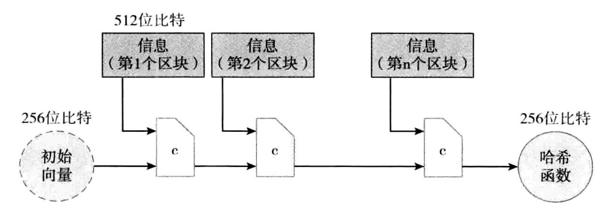

<!--
 * @Author: ZhXZhao
 * @Date: 2020-02-07 19:09:00
 * @LastEditors  : ZhXZhao
 * @LastEditTime : 2020-02-07 22:00:25
 * @Description: 
 -->
# 哈希函数

---
- [哈希函数](#%e5%93%88%e5%b8%8c%e5%87%bd%e6%95%b0)
  - [Feature1：碰撞阻力](#feature1%e7%a2%b0%e6%92%9e%e9%98%bb%e5%8a%9b)
  - [Feature2：隐秘性](#feature2%e9%9a%90%e7%a7%98%e6%80%a7)
  - [Feature3：谜题友好](#feature3%e8%b0%9c%e9%a2%98%e5%8f%8b%e5%a5%bd)
  - [安全哈希算法（Secure Hash Algorithm 256, SHA-256）](#%e5%ae%89%e5%85%a8%e5%93%88%e5%b8%8c%e7%ae%97%e6%b3%95secure-hash-algorithm-256-sha-256)

哈希函数的三个特性：

- 输入可为任意大小的字符串。
- 输出的大小固定。
- 对于特定的输入字符串，可以在合理时间内计算出输出。准确来说，对于n为的字符串，其哈希值计算的复杂度为O(n)。

哈希函数达到密码安全的三个属性：

- **碰撞阻力（collision-resistance**）
  无法找到两个值x和y，$x\neq y$,而H(x)=H(y)，则称哈希函数H具有碰撞阻力。
- **隐秘性（hiding）**
  如果当其输入r选自一个高阶最小熵的概率分布，在给定H(r||x)条件下来确定x是不可行的。*从高阶最小熵的分布中取样时，无法判定取样的倾向。*
- **谜题友好（puzzle-friendliness）** 
  *注：在一般的密码学中，谜题友好并非是密码安全的哈希函数的要求，但在加密数字货币中，这一特性是必须的。*
  如果对于任意n位输出值y，假定k选自高阶最小熵分布，如果无法找到一个可行的方法，在比$2^n$小很多时间内找到x，保证H(k||x)=y成立，那么我们称哈希函数H为谜题友好。

## Feature1：碰撞阻力
- 应用：信息摘要
  - 具有碰撞阻力的哈希函数，可以将其输出作为信息摘要。
  - 对于一个大的文件，只需对其应用哈希函数，生成固定长度的摘要，记住该摘要，便可对源文件进行验证。

## Feature2：隐秘性
- 应用：承诺
  承诺方案：commit(msg,nonce):=H(nonce||msg)
  - 首先产生一个临时随机数nonce，对于每次的承诺制，都需要选用新的随机值nonce。
  - 然后将nonce与承诺的信息msg一起打入到承诺函数commit()中，计算承诺函数输出值com，并公布。
  - 验证，设定找其他人应用H()来计算nonce和msg链接之后的哈希值，对比一下计算结果是否与承诺输出com相同。

  这便要求两个特性：
  - 隐秘性：已知H(nonce||msg),没有可行方法找到msg。
  - 约束性：没有可行方法找到两对(msg,nonce)和(msg',nonce')，$msg\neq msg'$，而H(nonce||msg)==H(nonce'||msg')。
  
  隐秘性即哈希函数要求的隐秘性，约束性即哈希函数的碰撞阻力特性，因此若哈希函数H具有碰撞阻力及隐秘性，承诺方案将有效。

## Feature3：谜题友好
- 应用：搜索谜题
  - 搜索谜题构成
    - 一个哈希函数H。
    - 从高阶最小熵分布选出的一个取值，id（我们称其为谜题ID）。 
    - 目标集合Y。
  
  该谜题的解决方法为一个解x，应满足：$H(id||x)\in Y$。
  如果一个哈希函数具备谜题友好特性，这就意味着对于这个谜题，没有一个解决策略比只是随机地尝试x取值会更好。这会被应用到比特币挖矿当中。

## 安全哈希算法（Secure Hash Algorithm 256, SHA-256）
如果能够找到一个可用于固定长度输入，且具备碰撞阻力的哈希函数（我们称这种函数为压缩函数），对其做MD变换，则可以转化为可接受任意长度的哈希函数。若基本压缩函数具有碰撞阻力特性，那么经过MD转换而生成的哈希函数也具有碰撞阻力。SHA-256是采用MD变换方法的常用哈希函数之一。
MD变换：现有一个输入长度为m，输出长度为n的压缩函数（n < m)。将任意长度的哈希函数的输入分为长度为m-n的区块。将每个区块与之前区块的输出一起代入到压缩函数，对于第一个区块而言，我们需选取一个初始向量，最后一个区块的输出作为最终的结果。
SHA-256函数利用了这样的一个压缩函数，这个压缩函数把一个768为的输入压缩成一个256位的输出，每个区块的大小是512位。过程如下图所示。

通过初始向量的补位，可以把输入变成512位比特的整数倍。

