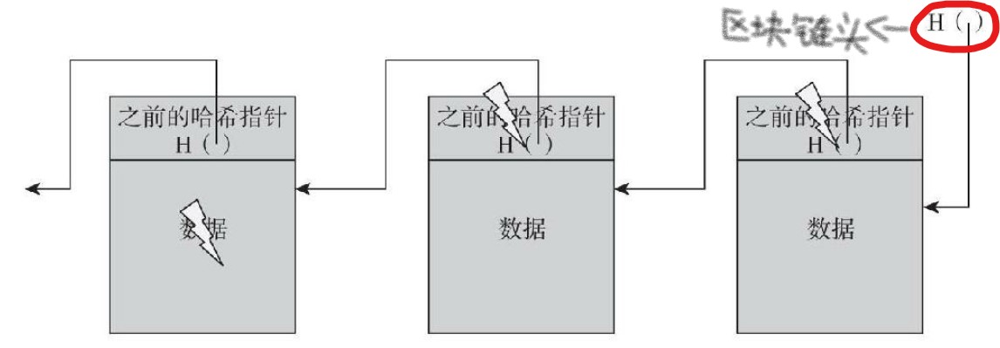
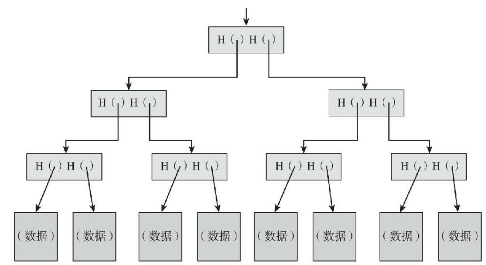

<!--
 * @Author: ZhXZhao
 * @Date: 2020-02-07 21:00:10
 * @LastEditors  : ZhXZhao
 * @LastEditTime : 2020-02-08 14:17:27
 * @Description: 
 -->
# 哈希指针及数据结构

---
- [哈希指针及数据结构](#%e5%93%88%e5%b8%8c%e6%8c%87%e9%92%88%e5%8f%8a%e6%95%b0%e6%8d%ae%e7%bb%93%e6%9e%84)
  - [区块链](#%e5%8c%ba%e5%9d%97%e9%93%be)
  - [梅克尔树](#%e6%a2%85%e5%85%8b%e5%b0%94%e6%a0%91)
  - [隶属证明](#%e9%9a%b6%e5%b1%9e%e8%af%81%e6%98%8e)
  - [非隶属证明](#%e9%9d%9e%e9%9a%b6%e5%b1%9e%e8%af%81%e6%98%8e)

**哈希指针**：一个指向数据存储位置及其位置数据的哈希值的指针。*普通的指针只能告诉你数据的存储位置，哈希指针不但可以告诉你数据存储的位置，还可以给你一种方式来验证数据没有被篡改过*

## 区块链

**区块链（block chain）**：通过哈希指针构建的链表。每个区块既含有数据，也含有指向上一个区块的哈希指针。
区块链的一大特性：**防篡改**
我们只需要将链表头部的哈希指针保存在对手无法修改的地方，便可以确保我们可以检测到篡改行为。链表头部的哈希指针被称为**创世区块（genesis block）**。

## 梅克尔树

**梅克尔树（Merkle trees）**：使用哈希指针的二叉树。同样用于**防篡改**。
在梅克尔树的数据结构中，所有的数据区块都被两两分组，指向这些数据区块的指针被存储在上一层的父节点（parent node）中，而这些父节点再次被两两分组，并且指向父节点的指针被存储在上一层的父节点中，一直持续这个过程，直到最后我们到达树的根节点。
因此，我们只需要记住树根的哈希指针，我们就可以通过哈希指针回溯到列表中的任何位置，这让我们能保证数据确实未经篡改。

## 隶属证明

梅克尔树与区块链不同的一点是，梅克尔树具有另一个特点：可以实现简洁的**隶属证明**。
若有人想要证明某个数据区块隶属于该梅克尔树，此人只需要向我们展示数据块信息以及从该数据块通向树根节点的那些区块，花费约lon(n)的时间（假设树上有n个节点）进行验证。

## 非隶属证明

**排序梅克尔树**：把底层的数据通过某些排序得到的梅克尔树。
有了排序梅克尔树，我们可以在一个对数复杂度的条件下验证某一个数据区块并非来自某梅克尔树。展示被验证区块之前的区块路径和被验证区块之后的区块路径，如果之前、之后两个区块在树上是连续的，那么这说明被验证区块与该梅克尔树之间是非隶属关系，因为，若被验证区块隶属于梅克尔树，则他需要在之前、之后区块之间，而之前、之后区块之间没有空间。

*其实我们可以在任何以指针为基础的数据结构中使用哈希指针，条件是数据结构不存在循环。*
