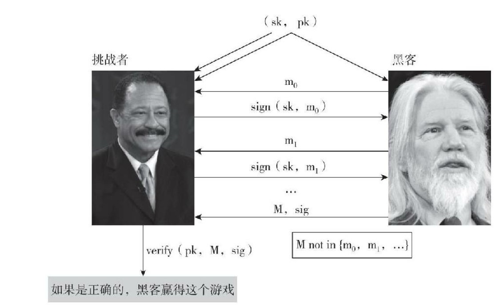

<!--
 * @Author: ZhXZhao
 * @Date: 2020-02-08 14:15:54
 * @LastEditors: ZhXZhao
 * @LastEditTime: 2020-03-01 17:14:06
 * @Description: 
 -->
# 数字签名及公钥即身份

---

- [数字签名及公钥即身份](#%e6%95%b0%e5%ad%97%e7%ad%be%e5%90%8d%e5%8f%8a%e5%85%ac%e9%92%a5%e5%8d%b3%e8%ba%ab%e4%bb%bd)
  - [数字签名](#%e6%95%b0%e5%ad%97%e7%ad%be%e5%90%8d)
    - [数字签名方案](#%e6%95%b0%e5%ad%97%e7%ad%be%e5%90%8d%e6%96%b9%e6%a1%88)
    - [实践中的应用](#%e5%ae%9e%e8%b7%b5%e4%b8%ad%e7%9a%84%e5%ba%94%e7%94%a8)
    - [椭圆曲线数字签名算法](#%e6%a4%ad%e5%9c%86%e6%9b%b2%e7%ba%bf%e6%95%b0%e5%ad%97%e7%ad%be%e5%90%8d%e7%ae%97%e6%b3%95)
  - [公钥即身份](#%e5%85%ac%e9%92%a5%e5%8d%b3%e8%ba%ab%e4%bb%bd)
    - [去中心化身份管理](#%e5%8e%bb%e4%b8%ad%e5%bf%83%e5%8c%96%e8%ba%ab%e4%bb%bd%e7%ae%a1%e7%90%86)

## 数字签名

### 数字签名方案
> 数字签名方案由以下三个算法构成：
> - (sk, pk) := generateKeys(keysize) generateKeys将keySize作为输入，输出一对公钥和私钥。私钥只有自己知道，用来签名一段消息，公钥人人可以看见，用来验证签名。
> - sig := sign(sk, message) sign（签名）将消息和私钥作为输入，输出签名。
> - isValid := verify(pk, message, sig) verify（验证）将消息、签名和公钥作为输入，输出若为真，则签名属实，若为假，则签名消息为假。
> 两个性质要求：
> - 有效签名可以通过验证，即：verify(pk, message, sign(sk, message)) == true
> - 签名不可伪造。

generateKeys和sign可采用随机算法，verify需要是确定的。

不可伪造性游戏

### 实践中的应用

**在实践中，我们通常对信息的哈希值进行签署**，因为信息可以是无限长，而签名方案只能签署有限位长度。
对哈希指针签名相当于签名覆盖了哈希指针所指向的整个数据结构。

### 椭圆曲线数字签名算法

比特币所使用的数字签名方案是椭圆曲线数字签名算法（ECDSA）。

算法参数：
- 个人密钥：256位
- 公钥（未压缩）：512位
- 公钥（压缩）：257位
- 待签名信息：256位
- 签名：512位

在使用ECDSA时，**要注意确保随机性的良好来源**。

## 公钥即身份

将数字签名中的公钥与一个人的身份对等，如果你看到一条消息的签名被公钥pk验证，那么即可认为是与pk对应的人在发布这条消息。
**实践中通常将公钥的哈希值作为一个人的身份。**

### 去中心化身份管理

公钥和私钥的体系使得，我们可以自己作为用户注册，而无须到一个中央机构注册为系统用户，想要新身份，随时可以生成一个。
在比特币中，**地址就是公钥的哈希值**。
虽然去中心化身份管理可以使得我们创建随机的身份，不泄露自己的真实身份，但我们在以这个身份做出一系列行为时，其他人可以通过该身份的行为模式来推断出这个身份的真实身份是什么。
