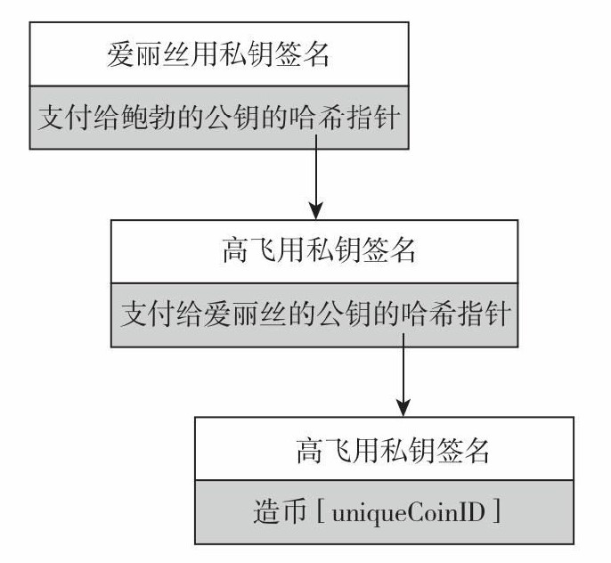
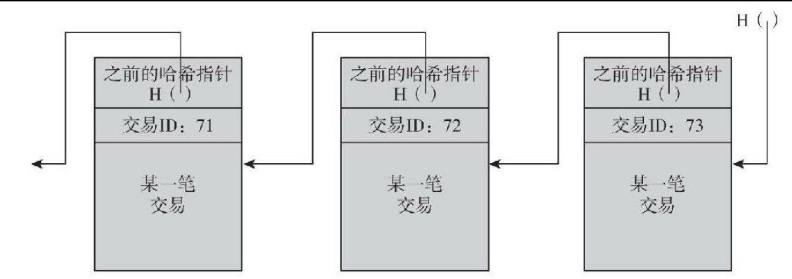

<!--
 * @Author: ZhXZhao
 * @Date: 2020-02-08 15:31:02
 * @LastEditors  : ZhXZhao
 * @LastEditTime : 2020-02-08 16:13:40
 * @Description: 
 -->
# 两种简单的加密货币

---

- [两种简单的加密货币](#%e4%b8%a4%e7%a7%8d%e7%ae%80%e5%8d%95%e7%9a%84%e5%8a%a0%e5%af%86%e8%b4%a7%e5%b8%81)
  - [高飞币](#%e9%ab%98%e9%a3%9e%e5%b8%81)
  - [财奴币](#%e8%b4%a2%e5%a5%b4%e5%b8%81)

## 高飞币

两个规则：
- 指定高飞可以随时创建新币，且这些新创建的币都属于他。
  为创建新币，高飞生成一个之前从未生成的唯一货币编号（uniqueCoinID），并建立字符串"CreateCoin [uniqueCoinID]"。然后使用私钥计算该字符串的数字签名。任何人都可验证该新币包含高飞的有效签名，因此新币为有效币。
- 拥有此币的人可以将其转给其他人。
  若高飞想将他创建的币转给Alice，则高飞需要创建一个新的声明：“将此币支付给Alice”，然后对其签名。这样Alice便拥有了这个币，因为她可以展示具有高飞签名的声明。Alice想转给Bob也是同样的步骤。

总结高飞币的规则流程：
- 高飞可以通过签名表示他使用唯一的货币编号来创建一个币。
- 币的所有人可以通过签名表示“将这个币转给X”，其中X为公钥，将其转给另一个人。
- 任何人都可以验证一只币的有效性，跟随哈希指针追溯到它是由高飞创建并验证过程中所有签名。

高飞币的安全隐患：**双重支付**。Alice将她的签名发给Bob而没有告诉其他人，Alice又创建了一个签名，声称将同样的这只币转给了Chuck。这样Bob和Chuck都可以表示自己是拥有这个币的人。

## 财奴币

为解决**双重支付**问题，提出财奴币。

1. 一个叫财奴的实体负责公布包含所有发生过的交易历史的仅增账目。

账目的仅增特性保证了写入这个账目的任何数据都会永久保留下来。这样，如果一个币之前转移给过不同的人，大家都可以看到，防止了双重支付的发生。
为执行这个仅增功能，财奴可以建立一个区块链，对于区块链，财奴要进行数字签名，只需要对头哈希指针进行签名。从而就形成了一系列数据块，每个数据块都包含一次交易（在实践中，一种优化的做法是将多次交易放入同一个区块中，比特币就是这样做的），每个区块包含交易的ID、交易的内容，以及上一个区块的哈希指针。

在财奴币中，只有在由财奴签名的区块链上交易才算数。
财奴币中有两种交易：造币和付币。
财奴币的问题：**财奴的权利过大**。（即中心化问题）