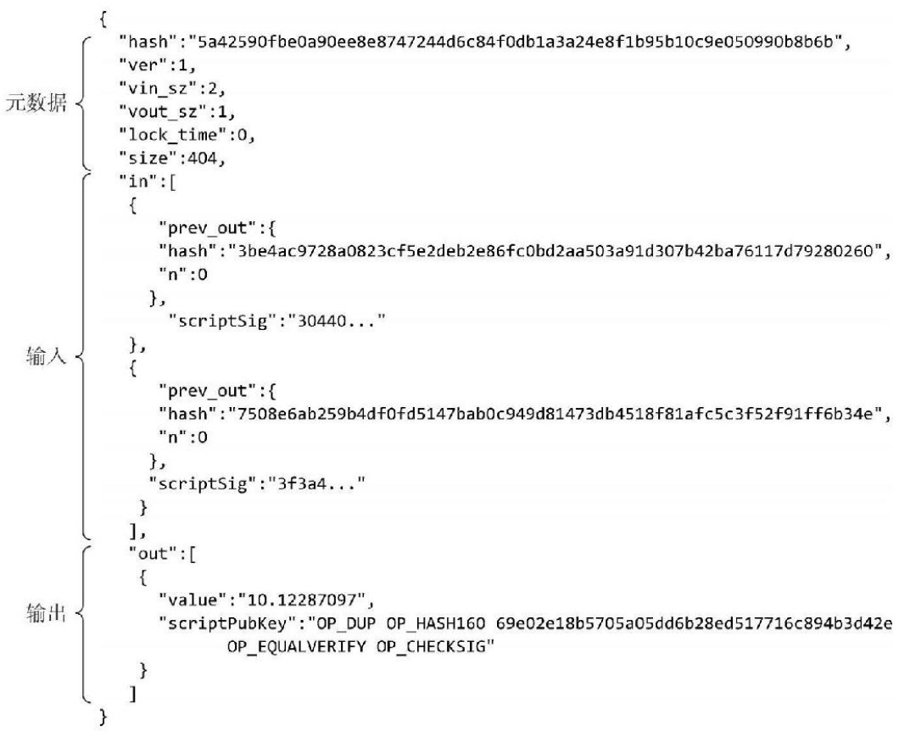

<!--
 * @Author: ZhXZhao
 * @Date: 2020-02-09 19:04:38
 * @LastEditors  : ZhXZhao
 * @LastEditTime : 2020-02-09 19:23:52
 * @Description: 
 -->
# 比特币交易

---

- [比特币交易](#%e6%af%94%e7%89%b9%e5%b8%81%e4%ba%a4%e6%98%93)
  - [地址转换](#%e5%9c%b0%e5%9d%80%e8%bd%ac%e6%8d%a2)
  - [有效验证](#%e6%9c%89%e6%95%88%e9%aa%8c%e8%af%81)
  - [资金合并](#%e8%b5%84%e9%87%91%e5%90%88%e5%b9%b6)
  - [共同支付](#%e5%85%b1%e5%90%8c%e6%94%af%e4%bb%98)
  - [交易语法](#%e4%ba%a4%e6%98%93%e8%af%ad%e6%b3%95)

每个交易都有一个输入值和输出值，输入值可以看成是将被消耗掉的币，输出可以看成是本次交易创造出来的币。铸造新币时只有输出没有输入。

## 地址转换

一个交易中的币，要么全被消耗掉，要么一个都不被消耗，不存在只消耗部分的情况。多出来的币可以转给自己的另一个地址，这叫地址转换。

## 有效验证

核查输入的币是否被消耗掉：只需从所引用的交易开始核查，一直核查到账本上最新记录的交易为止。

## 资金合并

将两笔交易中的输出作为一笔交易中的两个输入，产生一个输出，即资金合并。

## 共同支付

同样一笔交易的输入来自两个不同人的输出，交易的签名也需要两个人的签名。

## 交易语法

