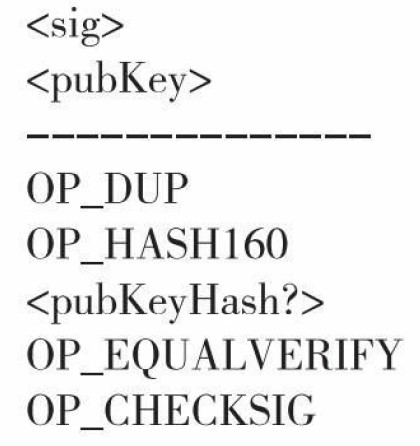
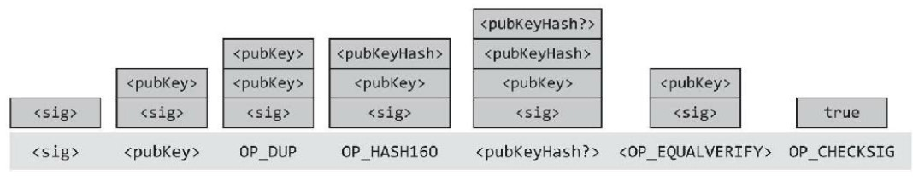

<!--
 * @Author: ZhXZhao
 * @Date: 2020-02-09 19:23:43
 * @LastEditors  : ZhXZhao
 * @LastEditTime : 2020-02-09 20:38:58
 * @Description: 
 -->
# 比特币脚本

---

- [比特币脚本](#%e6%af%94%e7%89%b9%e5%b8%81%e8%84%9a%e6%9c%ac)
  - [比特币脚本语言](#%e6%af%94%e7%89%b9%e5%b8%81%e8%84%9a%e6%9c%ac%e8%af%ad%e8%a8%80)
  - [执行一个脚本](#%e6%89%a7%e8%a1%8c%e4%b8%80%e4%b8%aa%e8%84%9a%e6%9c%ac)
  - [销毁证明](#%e9%94%80%e6%af%81%e8%af%81%e6%98%8e)
  - [比特币脚本的应用](#%e6%af%94%e7%89%b9%e5%b8%81%e8%84%9a%e6%9c%ac%e7%9a%84%e5%ba%94%e7%94%a8)
    - [第三方支付交易](#%e7%ac%ac%e4%b8%89%e6%96%b9%e6%94%af%e4%bb%98%e4%ba%a4%e6%98%93)
    - [绿色地址](#%e7%bb%bf%e8%89%b2%e5%9c%b0%e5%9d%80)
    - [高效小额支付](#%e9%ab%98%e6%95%88%e5%b0%8f%e9%a2%9d%e6%94%af%e4%bb%98)
    - [锁定时间](#%e9%94%81%e5%ae%9a%e6%97%b6%e9%97%b4)
    - [智能合约](#%e6%99%ba%e8%83%bd%e5%90%88%e7%ba%a6)

每个交易输出不仅确定了一个公钥，其实同时指定了一个脚本。交易的输入包括了脚本，为获得上一笔交易所输出的资金，我们需把交易的输入脚本（scriptPubKey）和上一笔交易的输出脚本（scriptSig）串联起来，这个串联脚本必须被成功地执行后才能获取资金。

## 比特币脚本语言
一种堆栈式的语言，每个指令只被执行一次，是线性的，无法循环执行。
CHECKMULTISIG指令要求n个公钥和一个参数t。在n个公钥中，至少可以选出t个现时有效的签名。CHECKMULTISIG指令用于查验交易中的多方签名。

## 执行一个脚本
堆栈语言中共有两类指令：数据指令和工作码指令。数据指令作用是把数据推到堆栈的最上面；工作码指令是用堆栈顶部的数据作为输入值，用来计算一个函数。

上图对应着脚本执行的堆栈状态图。

## 销毁证明

用于销毁比特币，引导客户使用其他数字货币系统。也可以通过发起一笔极小额的比特币交易，在脚本中加入你想说的事情，将信息永久地存储在区块链上。

## 比特币脚本的应用

### 第三方支付交易

通过多重签名实现。三个人，有两个人签名即可完成付款。

### 绿色地址

类似银行的概念，一笔交易由银行来进行支付，这样收款方看到是银行的支付就直接提供了服务，因为他相信银行不会做出失信的行为。

### 高效小额支付

一个交易需要Alice和Bob共同签名才生效，Alice把一大笔钱转到MULTISIG地址，然后每隔一段时间就签名一次，支付这段时间的费用，在Alice停止使用服务后，告诉Bob，Alice停止签名，Bob进行签名，确认了交易。

### 锁定时间

为避免Bob不在最后的时候签名，使Alice的钱都损失掉了，在小额支付开始钱，Alice与Bob签订一个交易，约定向Alice退还所有比特币，“退款”直到锁定时间到了为止才发生。

### 智能合约

智能合约就是那些不同于需要通过法律或者仲裁机构来保护执行的普通合约，智能合约是比特币系统里可以用技术手段来强制执行的合约。

