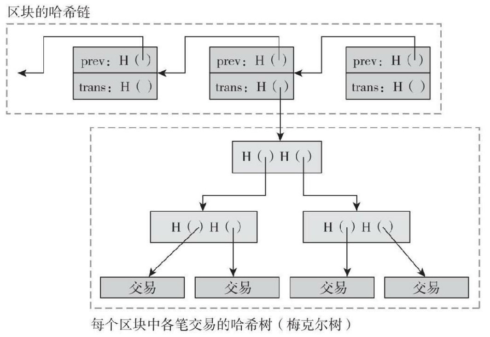

<!--
 * @Author: ZhXZhao
 * @Date: 2020-02-09 20:38:50
 * @LastEditors  : ZhXZhao
 * @LastEditTime : 2020-02-09 20:54:38
 * @Description: 
 -->
# 比特币的区块

---

将交易打包放入区块是为了性能优化，因为若每一个交易都需要矿工单独来达成共识，这样交易的处理速度将会很慢。

区块链中有两个基于哈希值的数据结构：
1. 哈希链
   哈希链是区块的哈希链
2. 梅克尔树
   梅克尔树是交易的梅克尔树

也就是说，链是用于连接区块的，树是用于区块里，将区块中的交易高效组织起来。

每个梅克尔树上都有一个**币基交易**：
1. 永远只有一个单一的输入与单一的输出。
2. 不消耗之前交易输出的比特币，没有指针指向上一个个交易。
3. 输出值为区块奖励加区块中包含的所有交易费。
4. 币基参数可以由矿工放任何值进去。

