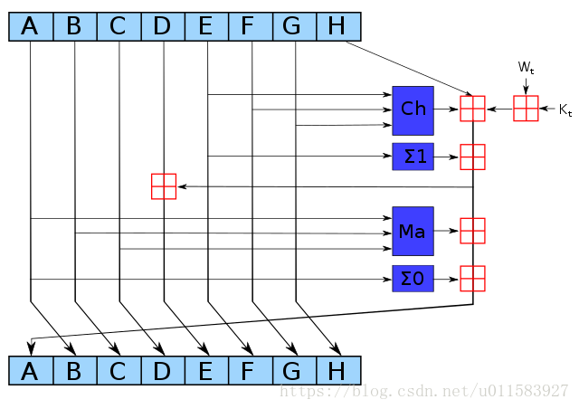

<!--
 * @Author: ZhXZhao
 * @Date: 2020-02-10 20:32:54
 * @LastEditors  : ZhXZhao
 * @LastEditTime : 2020-02-10 22:05:03
 * @Description: 
 -->
# 挖矿所需硬件

---


## SHA-256算法细节

SHA-256是一个256位的状态机。这256个状态被分割成8个32位的字段，这样可以最优化地运行在32位的硬件上。

### 初始化常量

SHA-256算法中用到了8个哈希初值和64个哈希常量。
8个哈希初值是对自然数中前8个质数的平方根的小数部分取前32位而得来的。
64个常量是对自然数中前64个质数的立方根的小数部分取前32位而得来的。

### 信息预处理

#### 附加填充比特

在报文末尾进行填充，使报文长度在对512取模后的余数使448。填充方式：先补第一个比特为1，然后都补0。
*注：信息必须填充，即便长度已满足对512取模后的余数为448 ，这时要补512个比特。*
**为什么是448？**
因为在第一步填充比特后，还会在第二步附加一个64比特的数据，用来表示原始报文长度信息，而448+64=512。

#### 附加长度值

附加长度值就是将原始数据（第一步填充前的消息）的长度信息补到已经进行了填充操作的消息后面。SHA256用一个64位的数据来表示原始消息的长度。因此，通过SHA256计算的消息长度必须要小于$2^{64}$，当然绝大多数情况这足够大了。

### 逻辑运算

|   逻辑运算    |      含义       |
| :-----------: | :------------: |
| $ \bigwedge $ |     按位与     |
|       ¬       |     按位补     |
| $ \bigoplus $ |    按位异或    |
|    $ S^n $    | 循环右移n个bit |
|    $ R^n $    |   右移n个bit   |

SHA-256用到的逻辑函数
> $ Ch(x,y,z)=(x \bigwedge y) \bigoplus (¬x\bigwedge z) $
> $ Ma(x,y,z)=(x \bigwedge y) \bigoplus (x \bigwedge z) \bigoplus (y \bigwedge z) $
> $ \sum_0(x)=S^2(x) \bigoplus S^{13}(x) \bigoplus S^{22}(x) $
> $ \sum_1(x)=S^6(x) \bigoplus S^{11}(x) \bigoplus S^{25}(x) $
> $ \sigma_0(x)=S^7(x) \bigoplus S^{18}(x) \bigoplus R^{3}(x) $
> $ \sigma_1(x)=S^{17}(x) \bigoplus S^{19}(x) \bigoplus R^{10}(x) $

### 计算信息摘要

首先将消息（即输入）分解成512bit大小的块。
假设消息M可以被分解为n个块，则整个算法需要做n次迭代，n次迭代的结果就是最终的哈希值，即256bit的数字摘要。
一个256bit的摘要的初始值$H_0$经过第一个数据块运算，得到$H_1$，即完成了第一次迭代。$H_1$再经过第二个数据块得到$H_2$，...，一次处理，最后得到$H_n$，$H_n$即位最终的256位消息摘要。
每次迭代映射用 $ Map(H_{i-1})=H_i $表示。
SHA-256算法中的最小运算单位称为“字”，一个字是32位。第一次迭代中，$H_0为最初“初始化常量”中的8个哈希初值。
#### Map过程

##### 构造64个字
对每一个块，将块分解为16个32bit的大端字，记为$W_0$,...,$W_{15}$，也就是说前16个字直接由消息的第i个块分解得到。其余字由迭代公式得到：$W_t=\sigma_1(W_{t-2})+W_{t-7}+\sigma_0(W_{t-15})+W_{t-16}$

##### 进行64次循环
映射 $ Map(H_{i-1})=H_i $包含了64次加密循环。即进行64次加密循环完成一次迭代。
每次加密循环如图所示：


图中红色田字方块代表模$2^{32}$加，即把两个数字加在一起，如果结果大于$2^{32}$，则除以$2^{32}$取余数作为结果。
ABCDEFGH一开始的初始值分别为$ H_{i-1}(0),H_{i-1}(1),…,H_{i-1}(7) $，$K_t$是第t个密钥，对应我们上文提到的64个常量，$W_t$是本区块产生的第t个字（在“构造64个字”节中提到），通过重复运行循环n次对ABCDEFGH这八个字循环加密。
最后一次循环所产生的八个字合起来即使第i个块对应到的哈希字符串$H_i$。

*注：在比特币机制下，为了得到供其他节点使用的哈希函数，实际上要求两轮SHA-256运算。*

## CPU挖矿

CPU挖矿伪代码
```cpp
TARGET = (65535 << 208 ) / DIFFICULTY;
coinbase_nonce = 0;
while(1){
    header = makeBlockHeader(transactions, coinbase_nonce);
    for (header_nonce = 0; header_nonce < (1 <<32); header_nonce++){
        if(SHA256(SHA256(makeBlock(header, header_nonce))) < TARGET)
            break;    //block found!
    }
    coinbase_nonce++;
}
```
根据现在的难度，普通个人的电脑CPU永远不可能通过挖矿赚钱。

## GPU挖矿

