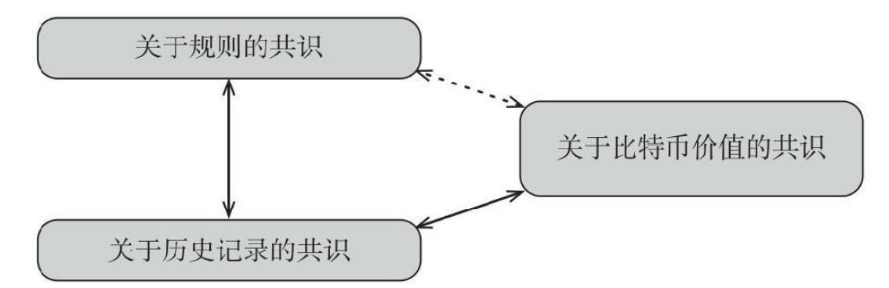

<!--
 * @Author: ZhXZhao
 * @Date: 2020-02-12 20:55:39
 * @LastEditors  : ZhXZhao
 * @LastEditTime : 2020-02-12 21:21:12
 * @Description: 
 -->
# 关于比特币的共识

---

人们在比特币问题上达成的三个共识：
1. 关于规则的共识。规则包括区块有效的机制，核心协议，数据格式等等。
2. 关于历史记录的共识。对区块链的内容，哪些属于区块链，那些不属于区块链的内容达成共识。
3. 关于比特币价值的共识。

三种共识之间的关系

比特币原始设计的天才之处就在于，它意识到靠自己本身很难达成这三种共识的任何一种，不过可以通过某种方式将这三种共识组合在一起，并让它们以一种相互依存的方式发挥作用。