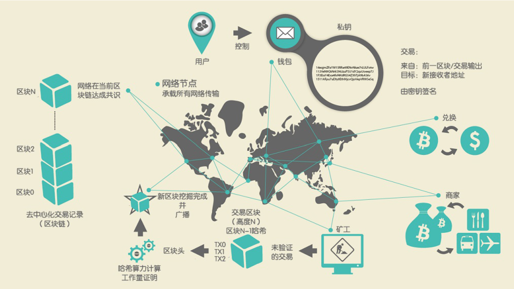
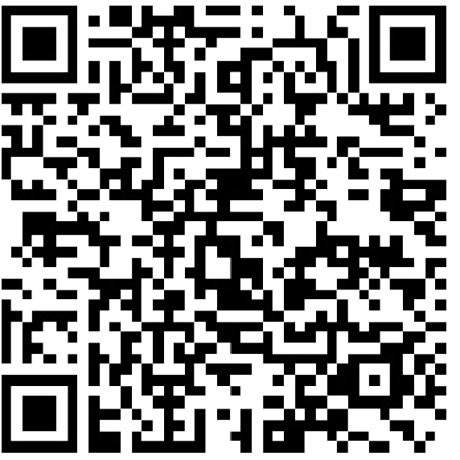

<!--
 * @Author: ZhXZhao
 * @Date: 2020-02-17 22:12:00
 * @LastEditors: ZhXZhao
 * @LastEditTime: 2020-02-17 22:12:00
 * @Description: 
 -->

# 交易、区块、挖矿和区块链

---

- [交易、区块、挖矿和区块链](#%e4%ba%a4%e6%98%93%e5%8c%ba%e5%9d%97%e6%8c%96%e7%9f%bf%e5%92%8c%e5%8c%ba%e5%9d%97%e9%93%be)
  - [比特币概述](#%e6%af%94%e7%89%b9%e5%b8%81%e6%a6%82%e8%bf%b0)
  - [买咖啡](#%e4%b9%b0%e5%92%96%e5%95%a1)

与传统银行和支付系统不同，比特币系统是以去中心化信任为基础的。由于比特币网络中不存在中央权威信任机构，“信任”成为了比特币用户之间存在的一种突出特性。

> 常见的区块链数据查询网站：
> [Blockchain info](https://blockchain.info)
> [Bitcoin Block Explorer](https://blockexplorer.com)
> [insight](https://insight.bitpay.com)
> [blockr Block Reader](https://blockr.io)

## 比特币概述

如图所示，我们可以看到比特币系统由用户（用户通过密钥控制钱包）、交易（每一笔交易都会被广播到整个比特币网络）和矿工（通过竞争计算生成在每个节点达成共识的区块链，区块链是一个分布式的公共权威账簿，包含了比特币网络发生的所有的交易）组成。

下面通过追踪一笔在网络上传输的交易来举例说明。

## 买咖啡

> 1毫比特币 = 千分之一比特币
> 1聪比特币 =  亿分之一比特币

当Alice在Bob咖啡店买一杯咖啡时，销售系统会为Alice显示法定货币（以美元为例）价格和比特币价格。同时也显示一个二维码。

这个二维码中的URL是：
> bitcoin:1GdK9UzpHBzqzX2A9JFP3Di4weBwqgmoQA?
amount=0.015&
label=Bob%27s%20Cafe&
message=Purchase%20at%20Bob%27s%20Cafe
根据BIP0021的定义，此URL的意思是：
A bitcoin address: "1GdK9UzpHBzqzX2A9JFP3Di4weBwqgmoQA"
The payment amount: "0.015"
A label for the recipient address: "Bob's Cafe"
A description for the payment: "Purchase at Bob's Cafe"

Alice扫描二维码并确认支付即可完成交易。
