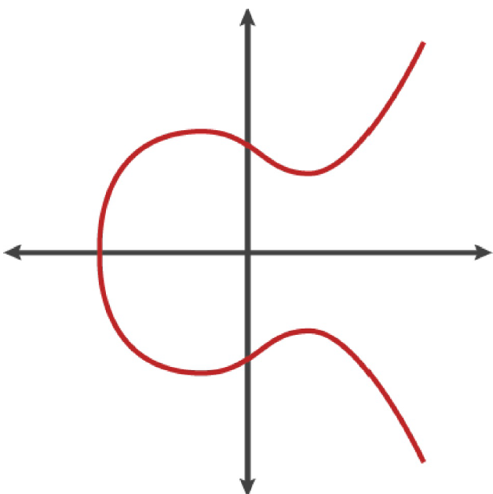
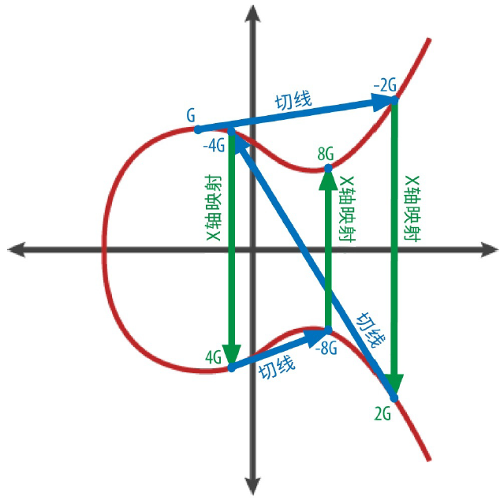

<!--
 * @Author: ZhXZhao
 * @Date: 2020-02-18 19:49:42
 * @LastEditors: ZhXZhao
 * @LastEditTime: 2020-02-18 22:07:37
 * @Description: 
 -->

# 密钥简介

---

数字密钥实际上并不是存储在网络中，而是由用户生成并存储在一个文件或简单的数据库中，称为钱包。

## 公钥加密和加密货币

比特币使用椭圆曲线乘法作为公钥加密的基础算法。公钥加密会创建一个密钥对，包括一个私钥和唯一对应的公钥。公钥用于接受比特币，私钥用于比特币支付时的交易签名。

大多数比特币钱包工具为了方便会将私钥和公钥以密钥对的形式存储在一起。然而，**公钥可以由私钥计算得到**，所以只存储私钥也是可以的。

## 私钥和公钥

私钥（k）是一个数字，通常是随机选出的。有了私钥，我们就可以使用椭圆曲线乘法这个单向加密函数产生一个公钥（K）。有了公钥（K），我们就可以使用一个单向加密哈希函数生成比特币地址（A）。

私钥、公钥和比特币地址之间的关系：
> 私钥(k) --椭圆曲线相乘(单向)--> 公钥(K) --哈希函数(单向)--> 比特币地址(A)

## 私钥

私钥是一个随机选出的数字。
生成私钥的第一步，也是最关键的一步就是找到足够安全的随机性来源。比特币软件使用操作系统底层的随机数生成器来产生256位的熵（随机性）。
详细来说，私钥可以是1和n-1之间的任何数字，其中n是一个常数（n=1.158 * $10^{77}$，略小于$2^{256}$），并由比特币所使用的椭圆曲线的阶所定义（见4.1.5 椭圆曲线密码学解释）。要生成这样的一个私钥，我们随机选择一个256位的数字，并检查它是否小于n-1。**从编程的角度来看**，一般是通过在一个密码学安全的随机源中取出一长串随机字节，对其使用SHA256哈希算法进行运算，这样就可以方便地产生一个256位的数字。如果运算结果小于n-1，我们就有了一个合适的私钥。否则，我们就用另一个随机数再重复一次。

## 公钥

公钥是私钥通过椭圆曲线算法计算得来的，这是不可逆转的过程：K = k * G。k是私钥，G是生成点的常数点。反向运算需要暴力搜索，即试验所有可能的k值，即在$2^{256}$的空间中搜索一个数，这显然是不可能的。

## 椭圆曲线密码学解释

椭圆曲线加密法是一种基于离散对数问题的非对称（公钥）加密法，可以用对椭圆曲线上的点进行加法或者乘法运算来表达。

一个椭圆曲线示例

比特币使用了secp256k1标准所定义的一条特殊的椭圆曲线和一系列数学常数。secp256k1曲线由下述函数定义，该函数可产生一条椭圆曲线。

$$ y^2 \ mod \ p = (x^3 + 7) \ mod \ p $$
其中$ p = 2^{256} - 2^{32} - 2^9 - 2^8 - 2^7 - 2^6 - 2^4 - 1 $

这条曲线的函数图像看起来像分散在两个维度上的散点图，很难作图画出。

secp256k1椭圆曲线性质：
- 给定椭圆曲线上的两个点$P_1$和$P_2$，则椭圆曲线上必定有第三个点$P_3 = P_1 + P_2$。
- $P_3$如何确定？在$P_1$和$P_2$之间画一条直线，这条直线与椭圆曲线的交点记为$P_3^{'}=(x,y)$，做$P_3^{'}$关于x轴的对称点即可得到$P_3=(x, -y)$。

在椭圆曲线的数学原理中，有一个点被称为“无穷远点”，这大致对应于0在加法中的作用。若$P_1$为“无穷远点”，则$P_2 = P_1 + P_2$

## 生成公钥

将随机生成的私钥k与曲线上已定义的生成点G相乘，获得的曲线上的另一点即为相应的公钥K。即

$$ K = k * G $$

生成点G是secp256k1标准的一部分，比特币密钥的生成点都是相同的。意味着一个私钥k乘以G将得到相同的公钥K。k和K之间的关系是固定的，但只能单向运算，即从k得到K。

在椭圆曲线中，点的相加等同于从该点画切线，找到与椭圆曲线的交点，然后做该交点关于x轴的对称点，该对称点即为相加得到的点。图片所示的为在实数域上的两点相加的操作，在素数域上也是同理。

> 大多数比特币程序使用OpenSSL加密库进行椭圆曲线计算。例如，调用EC_POINT_mul() 函数，可计算得到公钥。

