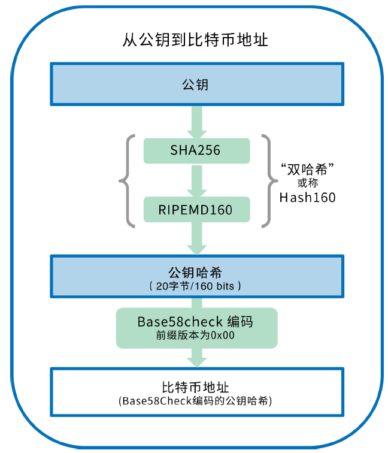
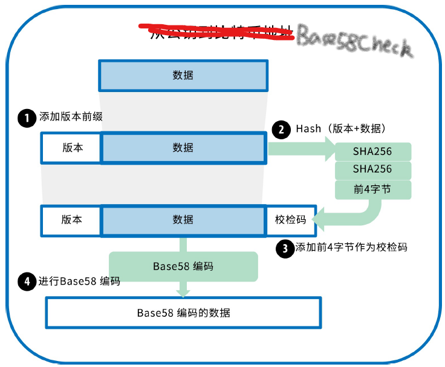
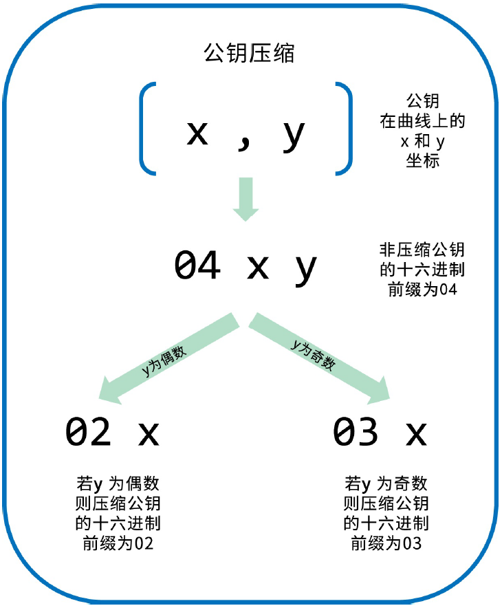

<!--
 * @Author: ZhXZhao
 * @Date: 2020-02-19 20:09:05
 * @LastEditors: ZhXZhao
 * @LastEditTime: 2020-02-20 15:21:50
 * @Description: 
 -->

# 比特币地址

---

- [比特币地址](#%e6%af%94%e7%89%b9%e5%b8%81%e5%9c%b0%e5%9d%80)
  - [Base58和Base58Check编码](#base58%e5%92%8cbase58check%e7%bc%96%e7%a0%81)
  - [密钥的格式](#%e5%af%86%e9%92%a5%e7%9a%84%e6%a0%bc%e5%bc%8f)
    - [私钥的格式](#%e7%a7%81%e9%92%a5%e7%9a%84%e6%a0%bc%e5%bc%8f)
    - [公钥的格式](#%e5%85%ac%e9%92%a5%e7%9a%84%e6%a0%bc%e5%bc%8f)
    - [压缩格式公钥](#%e5%8e%8b%e7%bc%a9%e6%a0%bc%e5%bc%8f%e5%85%ac%e9%92%a5)
    - [压缩格式私钥](#%e5%8e%8b%e7%bc%a9%e6%a0%bc%e5%bc%8f%e7%a7%81%e9%92%a5)

比特币地址是一个由数字和字母组成的字符串，由公钥（一个同样由数字和字母组成的字符串）生成的比特币地址以数字“1”开头。

由公钥生成比特币地址的过程：使用的算法是Secure Hash Algorithm(SHA)和the RACE Integrity Primitives Evaluation Message Digest(RIPEMD)，具体为SHA256和RIPEMD160。

以公钥K作为输入，输出长度为160比特的比特币地址A。
A = RIPEMD160(SHA256(K))

通常用户见到的比特币地址是经过“Base58Check”编码的。这种编码使用了58个字符和校验码，提高了可读性、避免歧义并有效防止了在地址转录和输入中产生的错误。也用在了私钥、加密的密钥和脚本哈希中。

## Base58和Base58Check编码

Base64使用了26个小写字母，26个大写字母，10个数字和两个符号（如“+”和“/”）。Base64通常用于编码邮件中的附件。

Base58是一种基于文本的二进制编码格式。这种编码不仅实现了数据压缩，保持了易读性，还具有错误诊断功能。Base58是Base64的子集，舍弃了一些容易读错和在特定字体中容易混淆的字符。具体为，Base58不包含Base64中的数字0，大写字母O，小写字母l，大写字母I，以及“+”和“/”。

**本质上，Base64编码是64进制，base58编码是58进制。**

Base58Check增加了错误校验码来检查数据在转录中出现的错误。为了使用Base58Check编码数据，首先我们要对数据添加一个称作“**版本字节**”的**前缀**，这个前缀用来明确需要编码的数据的类型。例如，对比特币地址编码的前缀为0（十六进制为0x00），对私钥编码的前缀为128（十六进制为0x80）。然后计算校验码：checknum = SHA256(SHA256(prefix+data))，在产生的32个字节的哈希值中，**取前4个字节作为校验码**。校验码添加到数据的后面。最后用Base58进行编码作为最后结果。

## 密钥的格式

### 私钥的格式

私钥的表示方法（编码格式）
WIF(Wallet Import Format)钱包导入格式

| 种类           | 版本（前缀） | 描述                                                         |
| -------------- | ------------ | ------------------------------------------------------------ |
| Hex            | None         | 64位的16进制数字                                             |
| WIF            | 5            | Base58Check编码：带有版本前缀128和32比特的校验码的Base58编码 |
| WIF-compressed | K or L       | 和Base58Check的区别是在编码前加一个0x01的后缀                |

同样的私钥以不同的编码格式编码出来的结果

| 格式           | 私钥                                                             |
| -------------- | ---------------------------------------------------------------- |
| Hex            | 1E99423A4ED27608A15A2616A2B0E9E52CED330AC530EDCC32C8FFC6A526AEDD |
| WIF            | 5J3mBbAH58CpQ3Y5RNJpUKPE62SQ5tfcvU2JpbnkeyhfsYB1Jcn              |
| WIF-compressed | KxFC1jmwwCoACiCAWZ3eXa96mBM6tb3TYzGmf6YwgdGWZgawvrtJ             |

### 公钥的格式

公钥主要分为**非压缩格式**和**压缩格式**。

公钥通常表示为前缀04（应为16进制）紧接着两个256比特的数字，其中第一个256比特数字是公钥x的坐标，另一个256比特数字是y坐标。前缀04表示非压缩格式公钥，压缩格式公钥是以02或者03开头。

### 压缩格式公钥

引入压缩格式公钥是为了减少比特币交易的字节数，从而可以节省那些运行区块链数据库的节点磁盘空间。每个公钥有520比特（包括前缀，x坐标，y坐标）。但根据公钥是椭圆曲线上的一个点，则满足$ y^2 \  mod \ p = (x^3 + 7) \ mod \ p $，所以可通过x而得到y，所以只存储公钥的x坐标，这样可将公钥的大小减少了256比特。注意到在得到y的过程中要进行开平方根，因此得出来的值可能是正值或负值，在素数p阶的有限域上对应的就是y可能是奇数或者偶数。为了区分这两种情况，在生成压缩公钥时，如果y是偶数，则使用02作为前缀，如果y是奇数，则使用03作为前缀。

由于压缩格式公钥和非压缩格式公钥都对应着同一个私钥，而压缩格式公钥和非压缩格式公钥产生的比特地址是截然不同的两个，这就会造成同一个私钥可以生成两种不同格式的公钥，对应生成两个不同的地址。

当较新的比特币钱包导入另一个钱包的私钥时，需要扫描区块链并找到与这些被导入的私钥相关的交易，但比特币客户端不知道应该扫描哪个地址（是压缩格式公钥产生的地址还是非压缩格式产生的地址？）

为解决这个问题，当私钥从钱包中被导出时，较新的比特币客户端使用**钱包导入格式（Wallet Import Format(WIF)）**，这种钱包导入格式可以用来表示该私钥已经被用来生成压缩的公钥，同时生成的比特币地址也是基于该压缩的公钥。

### 压缩格式私钥

“压缩的私钥”实际上只是表示“用于生成压缩格式公钥的私钥”。当一个私钥被使用WIF-compressed格式导出时，不但没有压缩，反而多出来一个字节，这个多出来的字节是私钥加了后缀01，用以表示该私钥是来自于一个较新的钱包，只能被用来生成压缩的公钥。

要注意的是，这些格式并不是可互换使用的。在较新的实现了压缩格式公钥的钱包中，私钥只能且永远被导出为WIF-压缩格式（以K或L为前缀）。对于较老的没有实现压缩格式公钥的钱包，私钥将只能被导出为WIF格式（以5为前缀）导出。这样做的目的是指示比特币客户端是以非压缩格式公钥产生的比特币地址去扫描区块链，还是以压缩格式公钥产生的比特币地址去扫描区块链。
