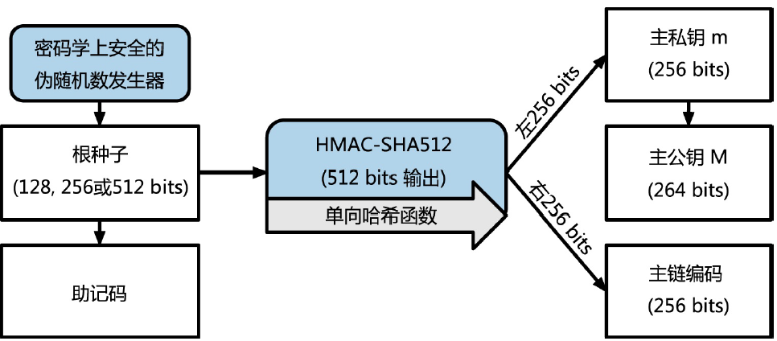
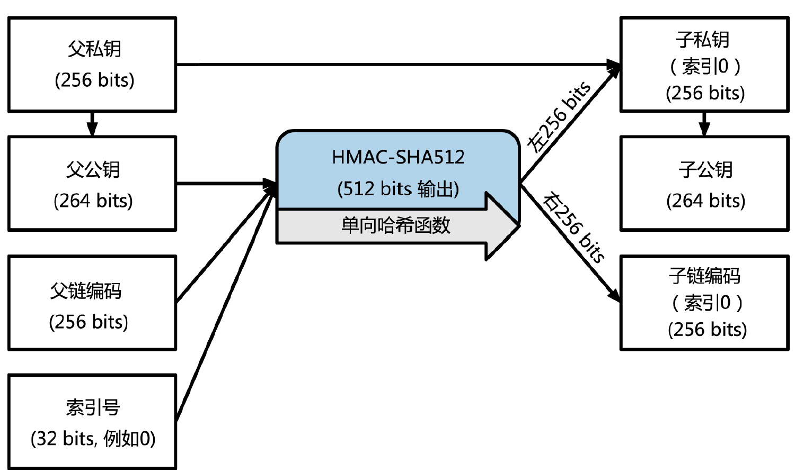
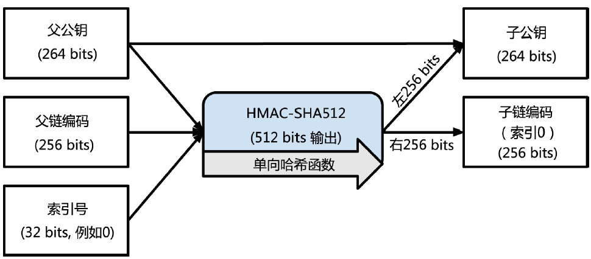

<!--
 * @Author: ZhXZhao
 * @Date: 2020-02-20 15:08:10
 * @LastEditors: ZhXZhao
 * @LastEditTime: 2020-02-20 17:42:54
 * @Description: 
 -->

# 比特币钱包

---

- [比特币钱包](#%e6%af%94%e7%89%b9%e5%b8%81%e9%92%b1%e5%8c%85)
  - [非确定性（随机）钱包](#%e9%9d%9e%e7%a1%ae%e5%ae%9a%e6%80%a7%e9%9a%8f%e6%9c%ba%e9%92%b1%e5%8c%85)
  - [确定性（种子）钱包](#%e7%a1%ae%e5%ae%9a%e6%80%a7%e7%a7%8d%e5%ad%90%e9%92%b1%e5%8c%85)
  - [助记码词汇(BIP0039)](#%e5%8a%a9%e8%ae%b0%e7%a0%81%e8%af%8d%e6%b1%87bip0039)
  - [分层确定性钱包(BIP0032/BIP0044)](#%e5%88%86%e5%b1%82%e7%a1%ae%e5%ae%9a%e6%80%a7%e9%92%b1%e5%8c%85bip0032bip0044)
    - [从种子中创造HD钱包](#%e4%bb%8e%e7%a7%8d%e5%ad%90%e4%b8%ad%e5%88%9b%e9%80%a0hd%e9%92%b1%e5%8c%85)
    - [子私钥的衍生](#%e5%ad%90%e7%a7%81%e9%92%a5%e7%9a%84%e8%a1%8d%e7%94%9f)
    - [使用衍生的子密钥](#%e4%bd%bf%e7%94%a8%e8%a1%8d%e7%94%9f%e7%9a%84%e5%ad%90%e5%af%86%e9%92%a5)
    - [扩展密钥](#%e6%89%a9%e5%b1%95%e5%af%86%e9%92%a5)
    - [子公钥推导](#%e5%ad%90%e5%85%ac%e9%92%a5%e6%8e%a8%e5%af%bc)
    - [强化子密钥的衍生](#%e5%bc%ba%e5%8c%96%e5%ad%90%e5%af%86%e9%92%a5%e7%9a%84%e8%a1%8d%e7%94%9f)
    - [HD钱包密钥识别符（路径）](#hd%e9%92%b1%e5%8c%85%e5%af%86%e9%92%a5%e8%af%86%e5%88%ab%e7%ac%a6%e8%b7%af%e5%be%84)

钱包是私钥的容器，通常通过有序文件或者简单的数据库实现。比特币钱包只包含私钥而不是比特币。

## 非确定性（随机）钱包

非确定性钱包只是随机生成的私钥集合。缺点很多，管理、备份及导入操作很麻烦，不推荐使用。

## 确定性（种子）钱包

确定性钱包包含通过使用单向离散方程而可从公共的种子生成的私钥。在确定性钱包中，种子足够收回所有已产生的私钥，所以只需备份种子即可，种子也可以轻松的在钱包之间转移。

## 助记码词汇(BIP0039)

助记码词汇是一个单词序列，单词序列可以重新创建种子，种子又可以重新创建钱包及所有的私钥。助记码词汇相较随机的数字顺序来说更容易读和抄写，因此复制钱包更容易。

助记码和种子的产生过程：
1. 创建一个128到256位的随机序列。
2. 将这个随机序列做SHA256哈希，取哈希结果的前几位作为随机序列的校验和，并把校验和加到随机序列的后面。
3. 把序列分解成一个集合，每个元素为11位。用这个集合去和一个预先定义好的2048个单词的字典做对应。
4. 生成一个12至24个词的助记码。

助记码表示128到256位的数，通过使用私钥抻拉函数PBKDF2来导出更长（512位）的种子。所得的种子可以创建一个确定性钱包及所派生的所有私钥。

## 分层确定性钱包(BIP0032/BIP0044)

分层确定性钱包：the hierarchical deterministic wallet(HD wallet)。
HD钱包包含从树结构所生成的密钥。父密钥可以生成子密钥，子密钥又可生成孙密钥。

HD钱包两个好处：
1. 树状结构可以表达额外的组织含义。如，一个分支用来支付，一个分支用来收款。
2. 允许使用者建立一个公钥序列而不需要访问相对应的私钥。这允许HD钱包在不安全的服务器中使用不同的公钥。

### 从种子中创造HD钱包

HD钱包从单个的根种子创建，根种子位128到256位的随机数。根种子通常表示为助记码词汇。

过程：

### 子私钥的衍生

分层确定性（HD）钱包使用CKD（child key derivation）方程从父密钥衍生出子密钥。

### 使用衍生的子密钥

通过子密钥无法得到父密钥，也无法得到兄弟密钥，只有父密钥和链码才能得到所有的子密钥。
子密钥用来做公钥和比特币地址。

### 扩展密钥

密钥衍生方程需要三个输入量：一个密钥，一个链码和想要的子密钥的索引。
扩展密钥（extended key）：密钥和链码的连接。
扩展密钥分为扩展私钥和扩展公钥。扩展私钥是私钥及链码的连接，扩展公钥是公钥及链码的连接。
扩展私钥可以创建完整的分支，扩展公钥只能创建公钥的分支。

### 子公钥推导

分层钱包一个很有用的特点就是可以不通过私钥而直接通过公共父公钥来派生出公共子公钥。

扩展公钥创建子公钥：

这种方式可以在不安全的服务器上，无需发送私钥，只需发送扩展公钥即可生成无限数量的公钥及比特币地址。

一种常见应用是在电商服务器上存储一个扩展公钥，这样可以为每笔交易产生不同的比特币地址，而无需知道私钥。

另一种常见应用是冷藏或硬件钱包。具体为扩展私钥保存在纸质钱包或离线的硬件设备上，扩展公钥在线存储。

### 强化子密钥的衍生

从扩展公钥衍生子公钥是有风险的，因为扩展公钥包含链码，一旦私钥泄露的话，链码加上私钥就可以衍生其他的子私钥。
为应对这种风险，HD钱包采用强化衍生（hardened derivation）替代方案。即用私钥去衍生链码和子公钥。

正常衍生方程中，索引号范围在$0 $到$ 2^{31}-1$之间。强化衍生方程中，索引号范围在$ 2^{31}$到$ 2^{32}-1$之间

### HD钱包密钥识别符（路径）

HD钱包中密钥用“路径”命名。主私钥衍生出的私钥起始以“m”打头，主公钥衍生出的以“M”打头，如第一个主私钥生成的子私钥是“m/0”

