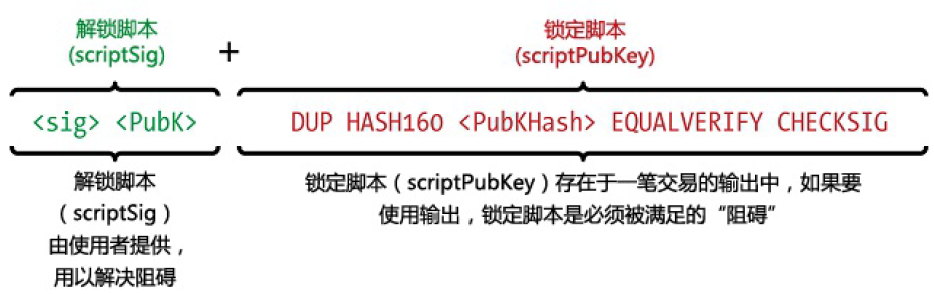

<!--
 * @Author: ZhXZhao
 * @Date: 2020-02-20 22:59:37
 * @LastEditors: ZhXZhao
 * @LastEditTime: 2020-02-20 23:42:39
 * @Description: 
 -->

# 比特币交易脚本和脚本语言

----

- [比特币交易脚本和脚本语言](#%e6%af%94%e7%89%b9%e5%b8%81%e4%ba%a4%e6%98%93%e8%84%9a%e6%9c%ac%e5%92%8c%e8%84%9a%e6%9c%ac%e8%af%ad%e8%a8%80)
  - [脚本创建（锁定与解锁）](#%e8%84%9a%e6%9c%ac%e5%88%9b%e5%bb%ba%e9%94%81%e5%ae%9a%e4%b8%8e%e8%a7%a3%e9%94%81)
  - [脚本语言](#%e8%84%9a%e6%9c%ac%e8%af%ad%e8%a8%80)
  - [图灵非完备性](#%e5%9b%be%e7%81%b5%e9%9d%9e%e5%ae%8c%e5%a4%87%e6%80%a7)
  - [非主权验证](#%e9%9d%9e%e4%b8%bb%e6%9d%83%e9%aa%8c%e8%af%81)

比特币客户端通过执行一个用类Forth脚本语言编写的脚本验证比特币交易。当一笔**比特币交易被验证**时，每一个输入值中的解锁脚本被与其对应的锁定脚本同时（互不干扰地）执行，从而查看这笔交易是否满足使用条件。

## 脚本创建（锁定与解锁）

比特币的**交易验证引擎**依赖于两类脚本来验证比特币交易：一个**锁定脚本**和一个**解锁脚本**。
**锁定脚本**是放在输出值上的“障碍”，明确了花费这笔输出的条件，锁定脚本往往含有一个公钥（比特币地址）。
**解锁脚本**是一个满足锁定脚本在输出上设定的花费条件的脚本，允许输出被消费。解锁脚本常常包含一个数字签名。

## 脚本语言

脚本语言通过从左至右地处理每个项目的方式执行脚本。

## 图灵非完备性

比特币脚本语言没有循环或复杂流控制功能以外的其他条件的流控制。这意味着脚本的复杂性有限，交易可执行的次数也可预见。受限制的语言能防止交易激活机制被人当作薄弱环节而加以利用。

## 非主权验证

一个脚本能在任何系统上以相同的方式执行，这意味着一个有效的交易对每个人而言都是有效的。
