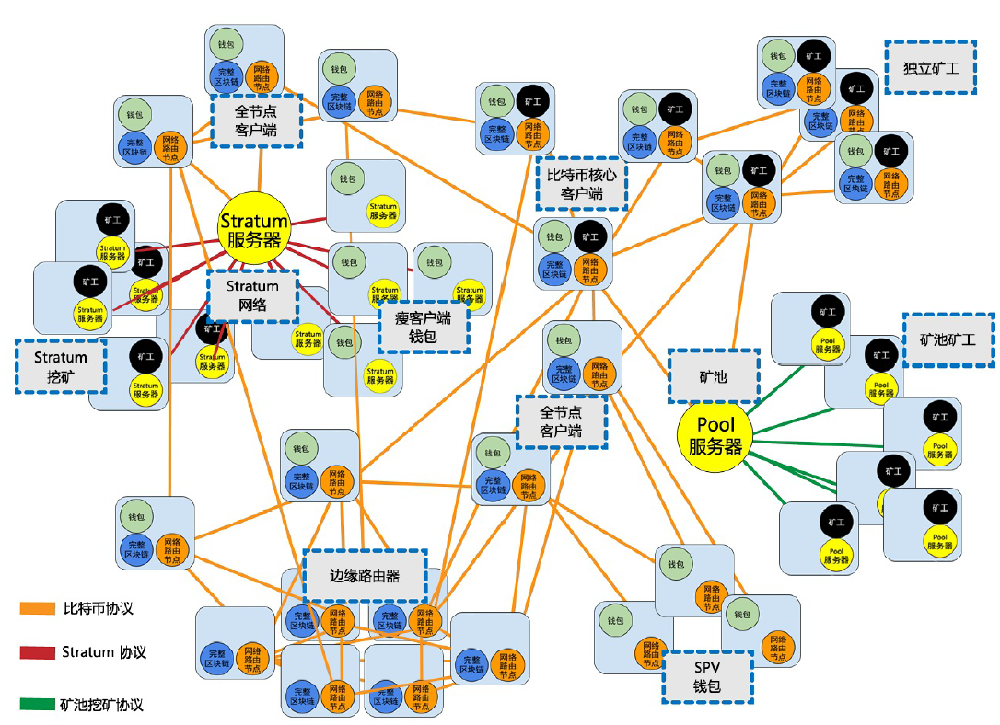

<!--
 * @Author: ZhXZhao
 * @Date: 2020-02-21 20:38:55
 * @LastEditors: ZhXZhao
 * @LastEditTime: 2020-02-21 20:52:30
 * @Description: 
 -->

# 扩展比特币网络

---

运行比特币P2P协议的比特币主网络由大约7000-10000个运行着不同版本比特币核心客户端（Bitcoin Core）的监听节点、以及几百个运行着各类比特币P2P协议的应用（例如BitcoinJ、Libbitcoin、btcd等）的节点组成。

