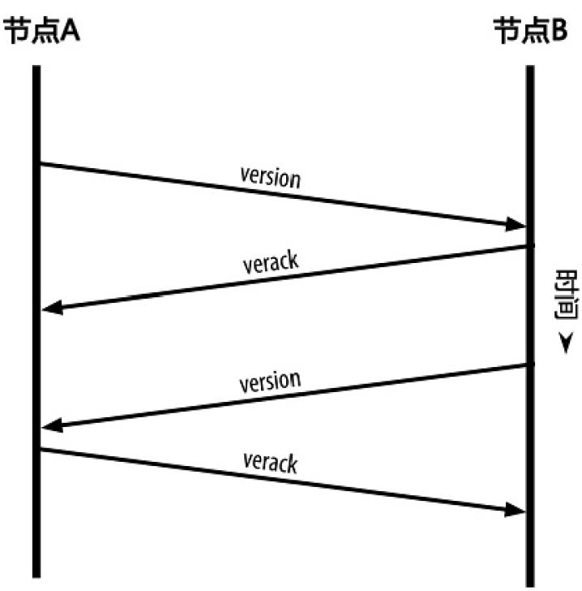
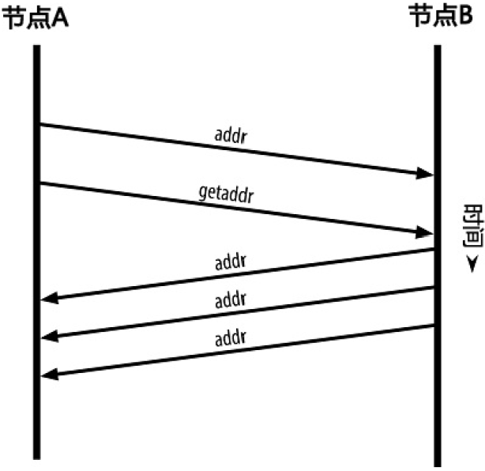

<!--
 * @Author: ZhXZhao
 * @Date: 2020-02-21 20:54:29
 * @LastEditors: ZhXZhao
 * @LastEditTime: 2020-02-21 21:36:48
 * @Description: 
 -->

 # 网络发现

 ---

 当新的网络节点启动后，为了能够参与协同运作，它必须发现网络中的其他比特币节点，可以随机选择网络中存在的比特币节点与之相连。节点通常采用TCP协议、使用8333端口与已知的对等节点建立连接。

 **新节点如何发现网络中的对等节点？**
 
 客户端会维护一个列表，列表中包含了那些长期稳定运行的节点，这样的节点称为“种子节点（seed nodes）”。连接到种子节点可以快速发现网络中的其他节点。

 建立连接：握手通信

 

 地址广播及发现

 
 
由于节点可以随时加入和离开，通讯路径是不可靠的。因此，节点必须持续进行两项工作：1）失去已有连接时发现新节点。2）在其他节点启动时为其提供帮助。

当节点重新启动时，会优先连接先前与其连接成功的节点，若都无应答，则可使用种子节点重新启动。如果节点持续某个连接长达90分钟没有任何通信，它会被认为已经从网络中断开，网络将开始查找一个新的对等节点。
