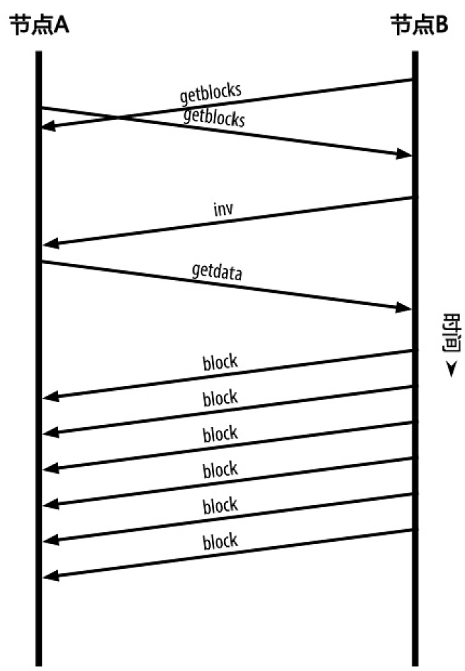

<!--
 * @Author: ZhXZhao
 * @Date: 2020-02-21 21:37:44
 * @LastEditors: ZhXZhao
 * @LastEditTime: 2020-02-21 22:02:33
 * @Description: 
 -->

# 全节点及交换库存清单

---

- [全节点及交换库存清单](#%e5%85%a8%e8%8a%82%e7%82%b9%e5%8f%8a%e4%ba%a4%e6%8d%a2%e5%ba%93%e5%ad%98%e6%b8%85%e5%8d%95)
  - [全节点](#%e5%85%a8%e8%8a%82%e7%82%b9)
  - [交换库存清单](#%e4%ba%a4%e6%8d%a2%e5%ba%93%e5%ad%98%e6%b8%85%e5%8d%95)

## 全节点

全节点是指维持包含全部交易信息的完整区块链的节点。完整区块链节点保有完整的、最新的包含全部交易信息的比特币区块链拷贝，这样的节点可以独立地进行建立并校验区块链。

## 交换库存清单

一个全节点连接到对等节点的第一件事是构建完整的区块链，全新的全节点只包含一个创世区块。同步区块链的过程从发送version消息开始，对等节点会交换getblocks消息，其中包含它们本地区块链的最新区块的哈希值。通过这个最新区块的哈希值，来比较自己本地存储的哈希链，若发现这个最新区块的哈希值属于自己的一个旧区块的，即可推出自身拥有的区块链比其他节点的更长。
拥有较长区块链的节点会发送inv消息，来使得其他节点补充区块。

