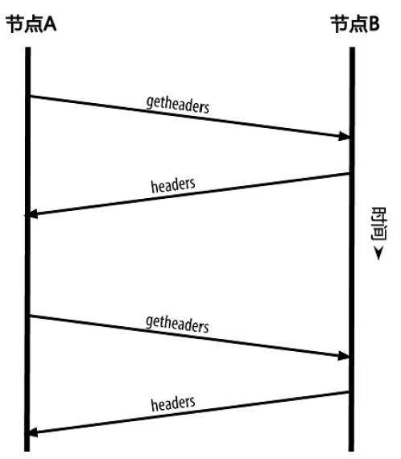

<!--
 * @Author: ZhXZhao
 * @Date: 2020-02-21 22:03:35
 * @LastEditors: ZhXZhao
 * @LastEditTime: 2020-02-21 22:36:55
 * @Description: 
 -->

 # 简易支付验证(SPV)节点

 ---

 不存储完整区块链的节点称为SPV节点。

 SPV节点只需下载区块头，而不用下载包含在每个区块中的交易信息。这样存储的区块链大小只有完整的1/1000。

 SPV节点通过在该交易信息和它所在的区块之间用merkle路径建立一条链接，证实交易的存在性。然后等待该交易所在的区块后又产生了6个区块来验证交易的有效性。

 > 全节点是通过检查整个链中在该交易之下的所有区块来保证这个UTXO没有被支付，即依赖区块高度，从而验证交易。SPV节点是通过检查在其上面的区块将它压在下面的深度来验证交易。

为防御针对SPV节点的拒绝服务攻击或双重支付攻击，SPV节点需要随机连接到多个节点，以增加与至少一个可靠节点相连接的概率。但这又会受到Sybil（女巫）攻击。

SPV节点同步区块头与全节点类似，使用的是getheaders消息。

由于SPV节点需要读取特定交易从而选择性地验证交易，这样就又产生了隐私风险。这可能会暴露钱包用户和比特币地址之间的联系。所以引入Bloom过滤器，允许SPV节点只接收交易信息的子集，同时不会精确泄露哪些是它们感兴趣的地址。
