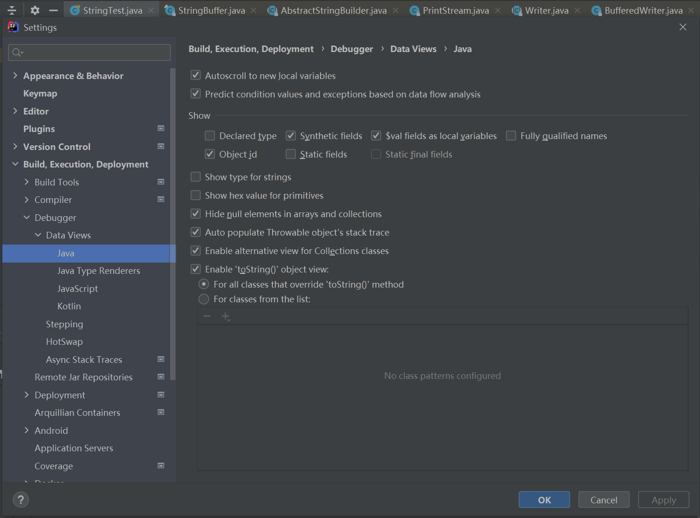

<!--
 * @Author: ZhXZhao
 * @Date: 2022-01-07 10:56:33
 * @LastEditors: ZhXZhao
 * @LastEditTime: 2022-01-07 11:08:51
 * @Description: file content
-->
# idea debug bug

前提：idea在debug过程中会自动调用对象的toString()方法。

idea单步调试StringBuffer类的对象的append方法时，变量toStringCache会显示有误，append(null)的时候toStringCache不会被赋值为null，如果不进入append方法单步调试，toStringCache又可以正常被赋值为null。（StringBuilder不会有此类问题）

解决方案：在idea的Settings -- Build, Execution, Deployment -- Debugger -- Data Views -- Java 中，取消勾选Enable "toString()" object view选项。调试完毕后再勾选回来。

